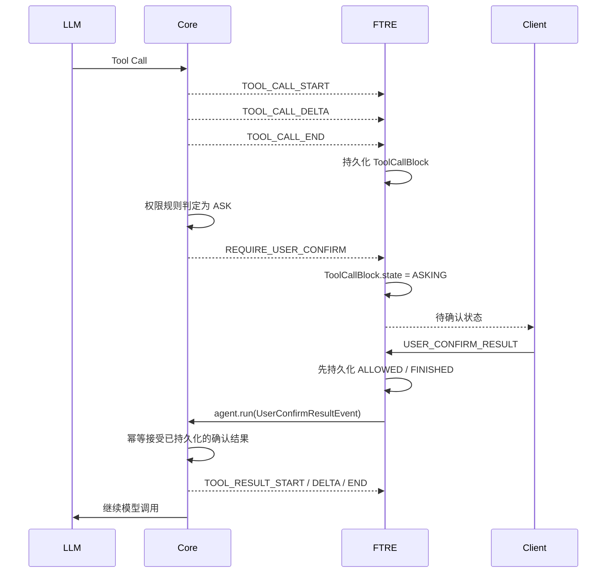

# Tool 权限确认、恢复与客户端 UI 上下文

> 整理时间：2026-07-31  
> 涉及仓库：`ftre-agent-core`、`ftre`、`ftre-desktop`  
> 当前改动均未 commit / push。

## 1. 本轮目标

本轮主要处理以下问题：

1. 用户同意执行 Tool 后，LLM 请求报错：

   ```text
   Invalid assistant message: content or tool_calls must be set
   ```

2. 多个 Tool 同时需要确认时，应用刷新、进程退出或电脑异常后，仍能恢复尚未确认的 Tool。
3. 拒绝 Tool 后，持久化结果、LLM 上下文和客户端展示保持一致。
4. 改进客户端的 Tool 确认卡和 Bash 执行结果 UI。

## 2. 已确认的正确事件顺序

模型必须先完整生成 Tool Call，Core 才能根据工具名和参数判断权限规则。因此顺序是：



关键结论：

- `REQUIRE_USER_CONFIRM` 在 `TOOL_CALL_END` 之后产生。
- `REQUIRE_USER_CONFIRM` 必须在真正执行工具之前产生。
- Tool 被拒绝时不会执行工具，但仍应生成完整的 Tool Result。
- `UserConfirmResultEvent` 是传入 Core 的控制命令，不应由 Core 再 `yield` 给上游。

## 3. 持久化和 Session 恢复

FTRE 不依赖重放 Core 的实时事件恢复页面，而是持久化聚合后的 assistant `Msg`：

```text
assistant Msg
└── content[]
    ├── ToolCallBlock(state=asking / allowed / finished)
    ├── ToolResultBlock(...)
    └── TextBlock(...)
```

客户端 Session 刷新后读取这个快照：

- `ToolCallBlock.state === "asking"`：重新展示待确认卡。
- `state === "allowed"`：表示确认已同意并已 checkpoint。
- `state === "finished"`：表示已拒绝或执行流程已经结束，具体结果由对应 `ToolResultBlock` 表示。

因此，多个 Tool 都需要确认时：

1. 每个 Tool 都用自己的 `tool_call_id` 持久化。
2. 用户只确认其中一个时，只更新对应 ID。
3. 其他仍为 `ASKING` 的 Tool 会继续保存在 Session 快照中。
4. 客户端刷新后仍能展示未处理的确认项。

## 4. Core 与 FTRE 的职责边界

### Core

Core 保持独立、无 FTRE 专属耦合，提供通用能力：

- 权限判定和确认状态机。
- 独立运行时，从内存中的 `ASKING` 接受确认。
- 面向持久化宿主时，幂等接受已经 checkpoint 为 `ALLOWED` 或 `FINISHED` 的相同确认。
- 将聚合消息正确转换成 LLM Provider 消息。
- 为拒绝操作生成非空 Tool Result。

### FTRE

FTRE 是有状态宿主，负责：

- 将 `TOOL_CALL_END` 和 `REQUIRE_USER_CONFIRM` 投影到 Session。
- 收到用户确认后，先持久化状态，再创建新 Agent 恢复执行。
- WebSocket 广播和客户端 Session 快照。
- 按 `tool_call_id` 管理批量确认。

## 5. 原始确认恢复异常

曾出现：

```text
RuntimeError: Agent is not awaiting confirmation; cannot accept a UserConfirmResultEvent.
```

原因：

1. FTRE 收到确认后，先把 Tool Call 持久化为 `ALLOWED`。
2. FTRE 随后创建新 Agent，并从 Session 快照恢复上下文。
3. 新 Core 实例看到的状态已经是 `ALLOWED`，不再是内存态的 `ASKING`。
4. 旧 `_accept_confirmation()` 只接受 `ASKING`，因此错误拒绝了合法恢复。

现在 `_accept_confirmation()` 支持两种合法路径：

- 独立 Core：`ASKING -> ALLOWED / FINISHED`。
- 持久化宿主：状态已经是预期的 `ALLOWED / FINISHED`，视为同一确认的幂等恢复。

相关日志包括：

```text
[permission] accept confirmation ...
[permission] apply pending confirmation ...
[permission] confirmation already checkpointed ...
```

## 6. LLM 400 与消息转换问题

### 6.1 空 assistant 消息

部分聚合消息转换后可能形成既没有 `content`、也没有 `tool_calls` 的 assistant 消息，Provider 会返回：

```text
Invalid assistant message: content or tool_calls must be set
```

Core Provider 边界增加了保护：过滤空 assistant 消息和仅包含内部 reasoning、但无法发送给 Provider 的消息。

### 6.2 Tool Result 被错误降级成 assistant 文本

持久化 assistant `Msg` 中可能同时包含：

```text
assistant text -> ToolCallBlock -> ToolResultBlock -> assistant text
```

以前聚合消息可能把 `ToolResultBlock` JSON 序列化进 assistant 文本，导致模型看到类似：

```json
[{"type":"text","text":"工具输出"}]
```

现在 Core 会在每个 Tool Result 前后切分 Provider 消息：

```text
assistant segment
tool message
assistant segment
```

同时，`ToolResultBlock.output` 中的文本块会扁平化成 Provider 所需的普通字符串。

### 6.3 用户拒绝后 Tool Result 为空

旧流程拒绝 Tool 时只产生：

```text
TOOL_RESULT_START
TOOL_RESULT_END
```

因此持久化为：

```json
{
  "output": [],
  "state": "denied"
}
```

继续调用 LLM 时可能变成空的 `role=tool` 内容。现在拒绝操作会额外产生文本增量：

```text
[USER_DENIED] 用户拒绝了工具 [bash] 的执行
```

最终 Tool Result 非空，状态仍为 `denied`。

## 7. 代码改动概览

### `E:\ftre-agent-core`

主要文件：

- `src/ftre_agent_core/agent/runner/react_runner.py`
  - 不再向上游 `yield UserConfirmResultEvent`。
  - 支持独立 Core 和持久化宿主两种确认恢复路径。
  - 增加权限确认日志与注释。
- `src/ftre_agent_core/agent/runner/_execute_acting.py`
  - 拒绝 Tool 时生成非空 Tool Result 文本。
- `src/ftre_agent_core/message/_msg.py`
  - 聚合消息支持确认结果状态转换。
- `src/ftre_agent_core/message_context.py`
  - 将聚合消息按 Tool Result 切分成 Provider 消息。
- `src/ftre_agent_core/message/_convert.py`
  - Tool Result 文本块扁平化。
- `src/ftre_agent_core/llm/completion.py`
  - Provider 边界过滤无效空 assistant 消息。
- `resume_tool_call_demo.py`
  - 简单的真实 DeepSeek API Tool 恢复交互测试脚本。

### `E:\ftre`

主要文件：

- `src/ftre/agent/turn_executor.py`
  - 收到确认后立即投影和 checkpoint，再恢复 Agent。
- `src/ftre/agent/session_projection.py`
  - 即时处理 `REQUIRE_USER_CONFIRM` 和 `USER_CONFIRM_RESULT`。
- 对应 HITL 和 Session projection 测试已更新。

### `E:\binn\ftre-desktop`

本轮直接相关文件：

- `packages/renderer/src/stores/chat.ts`
  - 支持 Tool Result 的 `denied` 状态。
  - 实时事件、确认结果和快照统一映射拒绝状态。
- `packages/renderer/src/stores/session.ts`
  - Session 历史快照支持 `denied`。
- `packages/renderer/src/stores/chat.protocol.test.ts`
  - 增加拒绝状态协议测试。
- `packages/renderer/src/features/chat/InlineToolCallCard.tsx`
  - 待确认卡片重新设计。
  - Tool 调用摘要与确认内容合并为一张卡。
  - 确认按钮改为胶囊形。
  - 支持拒绝状态展示。
  - Bash 完成态改为终端面板。

前端工作区还有其他已修改文件和 `.firecrawl/` 未跟踪目录，不确认全部属于本轮修改，后续提交时需要按 diff 仔细筛选。

## 8. 当前客户端 UI

### 确认卡

- `Ran <command>` 位于确认卡内部，不再与确认内容视觉分离。
- 状态显示为一个小橙点加“待确认”。
- 卡片使用中性灰配色，不再大面积使用琥珀色。
- “拒绝”和“允许执行”均为胶囊按钮。
- Bash 待确认参数直接显示为命令，不展示 JSON。

### Bash 执行详情

- Bash、exec、shell 使用终端式深色面板。
- 顶部显示 `Terminal`、cwd 和退出码。
- 命令使用 `>` 提示符展示。
- 输出紧跟命令，不再分成 `Arguments` 和 `Result` 两块。
- 支持复制输出。
- 错误输出使用红色。
- 面板最大高度为 320px，超出后滚动。

## 9. 已完成验证

已执行并通过的验证包括：

- Core 消息上下文、消息转换、权限执行、Completion 参数和 OpenAI 消息规范化相关测试。
- FTRE HITL、Session projection、事件历史相关测试。
- Desktop Tool Result 实时协议和快照拒绝状态测试。
- Desktop renderer 多次生产构建通过。

前端构建仍会显示项目原有警告：

- CSS 注释语法警告。
- 动态导入与静态导入共存警告。
- 大 chunk 警告。

这些警告不是本轮 Tool 权限和 UI 改动引入的阻塞错误。

## 10. 继续测试时的注意事项

1. 修改 Core 后必须重启 FTRE Gateway，Python 进程不会自动加载新的 Core 代码。
2. 不要使用之前污染过的 Session 判断新逻辑，应创建全新 Session 验证。
3. 推荐测试两个同时需要 ASK 的 Bash Tool：
   - 确认第一个后刷新 Session。
   - 检查第二个是否仍展示待确认。
   - 分别测试同意和拒绝。
4. 检查持久化状态：
   - 同意后为 `ALLOWED`，随后执行完成。
   - 拒绝后存在 `ToolResultBlock(state=denied)`，且 `output` 非空。
5. 检查发给 LLM 的 Provider 消息：
   - assistant Tool Call 消息包含 `tool_calls`。
   - Tool Result 使用 `role=tool`。
   - 不存在 `content=""` 且无 `tool_calls` 的 assistant 消息。
   - 不再把 Tool Result 文本块数组作为 JSON assistant 文本发送。

## 11. 当前结论

Tool 权限主流程已经形成完整闭环：

```text
生成 Tool Call
→ 权限拦截
→ 持久化 ASKING
→ 用户确认
→ checkpoint
→ 新 Agent 幂等恢复
→ 执行或拒绝
→ 持久化非空 Tool Result
→ 继续 LLM
```

架构上 Core 保持通用，FTRE 负责持久化和恢复，客户端通过 Session 快照恢复待确认状态。当前没有 commit 或 push。
