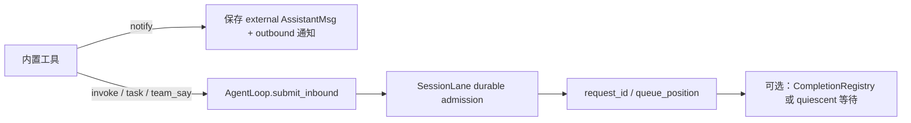

# PRD-A3-内置工具体系

> 状态生命周期：草稿 → 评审 → approved（定稿）→ 开发中 → 已验收

## 元信息

| 字段 | 值 |
|---|---|
| 阶段 | A3 |
| 名称 | 内置工具体系（bash/read/write/edit/set_workspace/cron/task/send_message/team） |
| 状态 | 已验收 |
| 创建日期 | 2026-08-12 |
| 定稿日期 | 2026-08-12 |
| 验收日期 | 2026-08-12 |
| 关联文档 | docs/TODO.yaml 阶段 A3；AGENTS.md |

## 1. 背景与目标

- **背景**：Agent 需要工具执行能力——文件读写、shell 命令执行、工作区切换、定时任务、子任务派发、跨 session 通信、多 Agent 团队协作。这些工具是 agent 与外部世界交互的核心接口。
- **目标**：实现完整的内置工具集，每个工具返回 `(result_str, metadata)` 元组，metadata 可被 Desktop Inspector 面板消费展示。
- **非目标**：不实现 Inspector 前端面板（ftre-desktop 仓库）、不实现工具的权限控制。

## 2. 需求范围

### 2.1 功能需求

- [x] FR1：bash shell 执行——执行 shell 命令，支持纯 cd 拦截持久切换工作区，semble 语义检索集成
- [x] FR2：read 文件读取——读取文件/图片/目录，返回内容 + metadata（含 content 快照、start_line/end_line）
- [x] FR3：write 文件创建——创建/覆盖文件，保留原编码和换行风格，返回 diff metadata
- [x] FR4：edit 文件编辑——字符串模式 + 行号模式修改文件，返回 before/after diff metadata
- [x] FR5：set_workspace 工作区切换——切换 session 工作区根目录，持久到 DB
- [x] FR6：cron 定时任务——创建/列表/删除/更新定时任务，CronScheduler 30s 扫描
- [x] FR7：task 子任务派发——派发提示词到 subagent session 同步执行，返回结果
- [x] FR8：send_message 跨 session 消息——notify 通知 / invoke 唤起目标 session
- [x] FR9：team 多 Agent 团队——team_create/team_add_agent/team_say/wait_agent/team_agent_status/team_delete
- [x] FR10：跨 session 投递语义——invoke、task、team_say 通过 AgentLoop durable admission；notify 明确为“不唤起 Agent”的旁路通知

### 2.2 非功能需求

- 性能：bash 命令默认 60s 超时，可扩展到 3600s
- 安全：工具返回值不包含 secrets/keys
- 兼容性：工具返回值统一 `(result_str, metadata)` 元组格式

## 3. 技术方案

### 模块设计

| 文件 | 职责 |
|---|---|
| `src/ftre/tools/bash.py` | Shell 命令执行，RTK 自动重写，semble 集成 |
| `src/ftre/tools/read.py` | 文件/图片/目录读取，返回 content metadata |
| `src/ftre/tools/write.py` | 文件创建/覆盖，返回 diff metadata |
| `src/ftre/tools/edit.py` | 字符串模式 + 行号模式编辑 |
| `src/ftre/tools/set_workspace.py` | 工作区切换 |
| `src/ftre/tools/cron.py` | 定时任务 CRUD |
| `src/ftre/tools/task.py` | 子任务派发（防递归） |
| `src/ftre/tools/send_message.py` | 跨 session 消息 |
| `src/ftre/tools/team.py` | 多 Agent 团队工具集 |

### 关键数据结构

```python
# 工具统一返回值
ToolResult = tuple[str, dict]
# metadata 示例（read 工具）
{
    "content": "文件内容快照",
    "file": "path/to/file",
    "start_line": 1,
    "end_line": 100
}
```

## 4. 跨 session 工具与消息队列边界



- `send_message(kind=notify)` 只给目标 Session 留下一条外部通知，不运行目标 Agent，也不占用其 mailbox；这是刻意的旁路语义。
- `send_message(kind=invoke)` 模拟目标 Session 的一条 `user_message`，返回 durable admission 结果；调用方只得到排队确认，不等待目标回复。
- `task` 使用独立 subagent Session，接纳后按本次 `request_id` 等待 `CompletionRegistry`，不会被同一 Session 的其他 Turn 误唤醒。
- `team_say` 只负责排队派活；`wait_agent` 等待成员 Session 的 quiescent barrier（当前 Turn、压缩和 pending 全部清空），再读取最后一条完整 Assistant Msg。
- subagent 不得递归调用 task/send_message；失败必须返回明确错误，不把“已入 Bus”误报为“已完成”。

## 5. 验收标准

- [x] AC1：每个工具可正确执行——bash 返回命令输出，read 返回文件内容，write 创建文件，edit 修改文件
- [x] AC2：工具返回 `(result_str, metadata)` 元组——metadata 含 content/before/after 等快照字段
- [x] AC3：Inspector 可消费 metadata——read 的 content 快照、edit/write 的 before/after diff 可在 Inspector 面板展示

## 6. 测试计划

- `tests/test_session_lane.py`：覆盖 invoke/task/team_say 的 durable admission、FIFO 和 request_id 幂等。
- `tests/test_session_fork.py`：确认 team/member session 删除与 profile 解绑不影响父 Session 历史。
- 补充自动化：当前仓库未发现独立的 send_message/team 路由测试，应增加 notify/invoke、拒绝自发消息和队列满错误用例。
- 手动验收：同一目标 Session 正在运行时分别发送 notify 和 invoke，确认 notify 不改变 Agent 状态，invoke 出现在 pending 并最终执行。

## 7. 变更记录

| 日期 | 变更 | 原因 |
|---|---|---|
| 2026-08-13 | 补充 notify/invoke/task/team_say 的真实投递和等待边界，明确哪些路径进入 SessionLane、哪些路径只是外部通知 | 避免所有跨 session 工具都被误认为同一种“消息队列”行为 |
| 2026-08-13 | 影响复核：FR10/协作边界为文档补充；原 AC1-AC3 不改变，send_message/team 独立自动化测试仍待补 | 诚实标记当前证据范围 |
