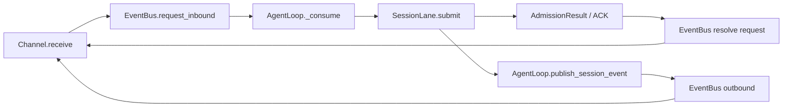

# PRD-A4-BusChannel协议

> 状态生命周期：草稿 → 评审 → approved（定稿）→ 开发中 → 已验收

## 元信息

| 字段 | 值 |
|---|---|
| 阶段 | A4 |
| 名称 | Bus + Channel 协议（TypedBusMessage + ws_channel + subagent_channel） |
| 状态 | 已验收 |
| 创建日期 | 2026-08-12 |
| 定稿日期 | 2026-08-12 |
| 验收日期 | 2026-08-12 |
| 关联文档 | docs/TODO.yaml 阶段 A4；AGENTS.md |

## 1. 背景与目标

- **背景**：A1 的 EventBus 是基础实现，缺乏强类型消息信封和耐久接纳语义。随着 WS Channel 和 subagent Channel 的引入，需要统一的 typed 消息协议，确保消息类型校验、request/reply 的 ACK 确认。
- **目标**：实现 `TypedBusMessage` 强类型信封、`BusMessage` type 白名单、request/reply 耐久接纳、ws_channel 和 subagent_channel 两个 Channel 适配器。
- **非目标**：不实现 SessionLane 并发模型（B1）、不实现 HTTP Channel。Bus/Channel 只负责可靠接纳请求，不负责执行 Agent，也不代表 Turn 已完成。

## 2. 需求范围

### 2.1 功能需求

- [x] FR1：TypedBusMessage 强类型信封——每条 Bus 消息包含 type、payload、metadata，类型在运行时校验
- [x] FR2：BusMessage type 白名单——定义合法消息类型枚举，非法类型在入队时拒绝
- [x] FR3：InboundMetadata / OutboundMetadata——携带 session_id、request_id、channel_id 等路由信息
- [x] FR4：request/reply 接纳确认——`request_inbound` 等待 AgentLoop 的明确 ACK；耐久性由下游 SessionLane/MailboxStore 保证，EventBus 本身不持久化业务状态
- [x] FR5：ws_channel frame_id→request_id 转换——WebSocket 帧的 frame_id 映射为内部 request_id
- [x] FR6：subagent_channel——为 subagent session 提供 Channel 适配，支持 task 工具派发的子任务通信

### 2.2 非功能需求

- 性能：Bus 消息分发为内存操作；durable admission 延迟受 state.json 原子写入影响，不以 <1ms 作为落盘 ACK 承诺
- 安全：消息 type 白名单防止注入非法消息类型
- 兼容性：新消息类型可通过白名单扩展，不影响已有类型

## 3. 技术方案

### 模块设计

| 文件 | 职责 |
|---|---|
| `src/ftre/bus/bus.py` | `EventBus`，inbound/outbound 队列 + 消息分发 |
| `src/ftre/bus/message.py` | `TypedBusMessage` 强类型信封定义 |
| `src/ftre/bus/protocol.py` | `BusMessage` type 白名单 + request/reply 协议 |
| `src/ftre/bus/payloads.py` | `InboundMetadata` / `OutboundMetadata` 等载荷定义 |
| `src/ftre/channel/ws_channel.py` | WebSocket Channel 适配，frame_id→request_id 转换 |
| `src/ftre/channel/subagent_channel.py` | Subagent Channel 适配 |

### 关键数据结构

```python
class BusMessage(BaseModel):
    id: str
    type: MessageType
    from_channel: str
    from_session: str
    to_channel: str
    to_session: str
    data: dict[str, Any]
    metadata: InboundMetadata

class TypedBusMessage(BusMessage, Generic[PayloadT]):
    data: PayloadT

class SessionMailboxSnapshotMessage(
    TypedBusMessage[SessionMailboxSnapshotPayload]
):
    type: Literal["session_event:mailbox_snapshot"]
```

`session_event:*` 和 `global_event:*` Topic 必须使用 `TypedBusMessage` 的具体子类；
普通 `user_message`/核心 `agent_event` 仍可使用基础 `BusMessage`。Payload 采用
Pydantic `extra="forbid"`，路由中的 session_id 与 Payload.session_id 不一致时拒绝。

## 4. 与 AgentLoop 的边界和消息时序

A4 的边界是“把外部输入可靠地送到 AgentLoop，并把接纳结果返回给入口”。
真正的 FIFO、压缩门控和 Turn 执行由 B1/B2/B3 负责，不能在 Channel 或 EventBus
中重复实现。



### 4.1 request/reply 的语义

- `request_inbound` 的成功只表示消息已经由 `SessionLane` durable admit 到
  `MailboxStore.pending`，ACK 中的 `request_id` 是后续取消、等待和状态关联的唯一键。
- ACK 不表示 Agent 已开始或已完成。执行进度通过 `session_mailbox_snapshot`、
  `agent_event` 等 outbound 消息通知；精确完成等待由 B1 的 `CompletionRegistry` 提供。
- `turn_cancel` 是控制消息，走 Bus request/reply，但不进入用户消息队列，也不写入
  `messages`；普通用户文本（包括命令文本）必须由 SessionLane 领取后才交给 B3。
- 入站消息先经过 `InboundData`/metadata 的类型校验，再进入 EventBus；业务层不得绕过
  `EventBus` 直接调用 Lane。

## 5. 验收标准

- [x] AC1：Bus 消息类型校验——提交非法 type 的消息被 EventBus 拒绝
- [x] AC2：request_inbound 等待 ACK——`request_inbound` 提交后发送方等待接收方 ACK，超时有明确错误
- [x] AC3：ws_channel admission ack 正确——WebSocket 帧到达后 ws_channel 正确转换 frame_id 为 request_id 并回 ACK

## 6. 测试计划

- `tests/test_bus_request_reply.py`：request/reply 等待、AgentLoop resolve、Bus stop 唤醒等待者。
- `tests/test_ws_control_commands.py`：attach/cancel/user_message 的控制面与 mailbox 面分离。
- `tests/test_ws_volatile_replay.py`：attach snapshot 与实时 outbound 事件不丢序。
- 单元验收：非法 Topic 使用裸 `BusMessage` 必须拒绝；Payload 额外字段、路由 session 不一致必须拒绝；缺少 frame_id 的 WS 用户消息必须明确失败。

## 7. 变更记录

| 日期 | 变更 | 原因 |
|---|---|---|
| 2026-08-13 | 补充 Channel → EventBus → AgentLoop → SessionLane 的边界、ACK 语义及控制消息规则；明确 Bus ACK 不等于 Turn 完成 | 将实现后的职责分离和消息时序固化到 PRD，避免 A4 与 B1/B3 的职责重叠 |
| 2026-08-13 | 将关键数据结构改为当前 Pydantic `BusMessage`/`TypedBusMessage`/Payload 子类，并补充 Topic 校验、路由一致性和测试计划 | 修正旧 PRD 中“裸 dict + dataclass”与现行 Bus 协议不一致的问题 |
| 2026-08-13 | 影响复核：AC1-AC3 对应的现有 Bus/WS 测试定向通过；本次仅改文档 | 记录协议契约校正没有引入代码行为变化 |
