# PRD-B1-SessionLane架构

> 状态生命周期：草稿 → 评审 → approved（定稿）→ 开发中 → 已验收

## 元信息

| 字段 | 值 |
|---|---|
| 阶段 | B1 |
| 名称 | AgentLoop SessionLane 架构（SessionLaneRegistry + MailboxStore + ContextGate + CompletionRegistry + TurnExecutor） |
| 状态 | 已验收 |
| 创建日期 | 2026-08-12 |
| 定稿日期 | 2026-08-12 |
| 验收日期 | 2026-08-12 |
| 关联文档 | docs/TODO.yaml 阶段 B1；AGENTS.md |

## 1. 背景与目标

- **背景**：旧 AgentLoop 用 `asyncio.Lock` 串行化所有 session，无法保证 durable admission（崩溃后 pending 丢失）和精确等待（无法按 request_id 等待特定 turn 完成）。随着并发 session 数量增长，需要按 session 隔离的 actor 模型。
- **目标**：实现 SessionLane 架构——每个 session 有唯一 worker（SessionLane），MailboxStore 持久化 pending 队列，ContextGate 水位检查，CompletionRegistry 精确等待，at-most-once 领取语义；同时把 Channel/Bus 的可靠接纳和 TurnExecutor 的单轮执行串成一条清晰流水线。
- **非目标**：不实现 CompactManager 的压缩算法（B2），不实现 TurnExecutor 的 Agent/Hook/命令执行细节（B3）。SessionLane 只负责编排这些组件，不复制它们的业务逻辑。

## 2. 需求范围

### 2.1 功能需求

- [x] FR1：SessionLaneRegistry 每 session 唯一 worker——维护 lane 生命周期，保证一个 session 只有一个 lane，支持懒创建
- [x] FR2：MailboxStore request_id 幂等持久队列——pending 消息持久化到存储，request_id 去重防止重复入队
- [x] FR3：ContextGate 水位检查——领取下一条请求前执行 80% 强制检查；一轮完成且仍有 pending 时执行 70% 预压缩检查，必要时等待压缩完成
- [x] FR4：CompletionRegistry 精确等待——按 request_id 注册完成回调，等待特定 turn 完成后通知
- [x] FR5：at-most-once 领取语义——pending 被取走后 Gateway 崩溃时不自动重放，已写入 messages 的 UserMessage 保留
- [x] FR6：可靠接纳与状态快照——先将请求写入 MailboxStore.pending，再返回 `AdmissionResult`；状态快照同时携带 phase 和 pending 列表，客户端不需要刷新即可看到排队消息
- [x] FR7：取消边界——取消 active turn 只取消当前执行，不改变 pending；取消 queued message 只删除指定 request_id

### 2.2 非功能需求

- 性能：不同 session 可并行执行，无全局锁
- 安全：同一 session 任意时刻最多一个 active turn
- 兼容性：不变量——turn 与 compaction 不会并发

## 3. 技术方案

### 模块设计

| 文件 | 职责 |
|---|---|
| `src/ftre/agent/session_lane.py` | `SessionLane`，单 session actor，FIFO + 取消 + 压缩门控 + 状态发布 |
| `src/ftre/agent/mailbox_store.py` | `MailboxStore`，request_id 幂等持久队列 |
| `src/ftre/agent/context_gate.py` | `ContextGate`，水位检查 + 压缩等待 |
| `src/ftre/agent/completion_registry.py` | `CompletionRegistry`，精确等待（按 request_id） |
| `src/ftre/agent/loop.py` | `AgentLoop`，按 session_id 路由到对应 lane |
| `src/ftre/agent/turn_executor.py` | `TurnExecutor`，执行单个已领取的 turn |

### 关键数据结构

```python
@dataclass
class QueueItem:
    request_id: str
    sequence: int
    content: str
    attachments: list[dict]
    agent_id: str
    # QueueItem 在磁盘上只表示 pending；领取后从 pending 移除，active 只存在内存。

@dataclass(frozen=True)
class AdmissionResult:
    accepted: bool
    session_id: str
    request_id: str
    queue_position: int
    created: bool
    error: dict | None

class SessionLane:
    session_id: str
    mailbox: MailboxStore
    gate: ContextGate
    completion: CompletionRegistry
```

### 不变量

- 不同 session 可以并行执行
- 同一个 session 任意时刻最多一个 active turn
- turn 与 compaction 不会并发
- pending 消息在被领取前不会写入当前 Turn 的 LLM context
- Bus ACK 只确认 durable admission；Turn 完成必须以 `TurnOutcome`/CompletionRegistry 为准

## 4. 端到端流程与职责边界

```mermaid
flowchart LR
    CH["Channel.receive"] --> BUS["EventBus.request_inbound"]
    BUS --> LOOP["AgentLoop._consume"]
    LOOP --> REG["SessionLaneRegistry"]
    REG --> SUB["SessionLane.submit"]
    SUB --> STORE["MailboxStore.admit"]
    STORE --> P["Mailbox.pending"]
    SUB --> ACK["AdmissionResult / ACK"]
    P --> PEEK["worker peek 队首"]
    PEEK --> G1["ContextGate.before_claim 80%"]
    G1 -->|"需要压缩，队首保持 pending"| CMP["CompactManager"]
    CMP --> G1
    G1 -->|"允许领取"| TAKE["MailboxStore.take"]
    TAKE --> EXEC["TurnExecutor.execute"]
    EXEC --> MSG["SessionProjection 写入 UserMsg"]
    MSG --> EVENT["AgentLoop 发布 agent_event"]
    EXEC --> OUT["TurnOutcome"]
    OUT --> DONE["CompletionRegistry.complete + snapshot"]
    DONE --> G2["ContextGate.after_turn 70%（有 pending 时）"]
    G2 -->|"需要压缩"| CMP2["CompactManager"]
    CMP2 --> G2
    G2 --> PEEK
```



### 4.1 每个模块只做一件事

- **Channel**：接收 WS/内部工具输入，规范化为 `BusMessage`，不执行 Agent。
- **EventBus**：提供 inbound/outbound 队列和 request/reply，不保存业务队列，也不判断压缩。
- **AgentLoop**：消费 Bus、按 `session_id` 找 Lane，并统一发布快照/事件。
- **SessionLane**：单 session actor；串行执行 admission、领取、压缩门控、Turn 收尾和下一条调度。
- **MailboxStore**：只负责 pending 的持久化、幂等、FIFO、领取和删除。
- **ContextGate**：只负责水位判断和等待 CompactManager；80% 在领取前，70% 在一轮完成后且仍有 pending 时。
- **TurnExecutor**：只执行一条已经领取的 Turn，返回 `TurnOutcome`；不领取队列、不启动自动压缩。
- **CompletionRegistry**：进程内按 `request_id` 唤醒精确等待者；不是持久化状态的来源。

### 4.2 状态的读取方式

`phase` 表示 Lane 当前的运行操作（如 `running`、`compacting`、`blocked`），
`pending` 是独立的队列数据。客户端必须同时读取两者：不能仅凭 `phase=idle` 判断
队列为空，也不能把 Bus ACK 当作“已经开始执行”。

### 4.3 request_id 的生命周期

| 阶段 | 所在位置 | 是否持久化 | 允许的下一步 |
|---|---|---:|---|
| 已接纳 | `MailboxState.pending[]` | 是 | peek、取消、领取 |
| 已领取 | `SessionLane._operation.item` | 否 | 执行、取消当前 Turn |
| UserMsg 已写入 | `messages[].metadata.request_id` | 是 | 继续执行或重试同 request_id 时去重 |
| Turn 终态 | `CompletionRegistry` | 否 | 同进程 wait 返回；进程重启不恢复 |
| pending 取消 | 不再存在于 mailbox | 是（删除结果） | 完成等待者收到 cancelled |

同一 session 内，`request_id` 是 mailbox、UserMsg、ACK 和取消接口共用的幂等键。
入口重试必须复用原 request_id；服务端不能因为 Bus 重发而生成第二条 QueueItem。

### 4.4 接口与错误语义

- `SessionLane.submit(inbound) -> AdmissionResult`：写盘成功后才返回 `accepted=True`；`queue_full`、`session_closing`、`session_required`、`admission_rejected` 均返回 `accepted=False` 和结构化 `error`。
- `SessionLane.cancel_active(expected_request_id)`：只取消当前 active；期望 request_id 不匹配或当前处于共享 compact 时返回 `False`，pending 不受影响。
- `SessionLane.cancel_pending(request_id)`：只删除仍在 pending 的项目；已领取返回空结果，HTTP 层映射为冲突。
- `AgentLoop.wait_request(session_id, request_id)`：只等待该 request 的当前进程终态；需要等待整个队列时使用 `wait_session_quiescent`。
- `AgentLoop.publish_mailbox_snapshot`：以 `MailboxState.revision` 单调递增发布 `phase + pending + accepting_messages + can_cancel_active`，客户端不得自行拼状态。

### 4.5 启动、停止和删除

- 启动时 `SessionLaneRegistry.recover()` 只扫描有 pending 的 Session，并为其启动 worker；active Turn 不自动重放。
- 停止/删除先关闭 admission 栅栏，再取消并等待 worker/真实 compact 任务，最后才删除 Session 文件或移除 Registry Lane。
- `SessionLane` 内部 worker 是唯一消费循环；worker 异常时进入 `blocked` 并保留队首，不丢弃 pending、不无限重试。

## 5. 验收标准

- [x] AC1：同 session 最多一个 active turn——并发提交多条消息到同一 session，只有一条在执行
- [x] AC2：turn 与 compaction 不并发——压缩进行中时新 turn 等待，不并发执行
- [x] AC3：pending 持久化可恢复——提交 pending 后重启 Gateway，pending 队列恢复
- [x] AC4：request_id 幂等——相同 request_id 重复提交不会产生重复 pending
- [x] AC5：取消 active 不影响 pending——取消 A 后 B/C 仍按 FIFO 执行；取消 queued 只移除指定 request_id
- [x] AC6：崩溃恢复边界——state.json 只恢复 pending，已领取 active 不自动重放，已 checkpoint 的 messages 保留
- [x] AC7：容量口径一致——capacity 只限制持久化 pending，active 不重复占用队列容量
- [x] AC8：关闭栅栏——close/delete 与并发 submit 不会重新创建可写 Lane

## 6. 测试计划

- `tests/test_session_lane.py`：FIFO、精确等待、入队快照先于 worker、active/pending 分离、取消、容量、revision、关闭栅栏。
- `tests/test_session_projection.py`：UserMsg/Reply Msg 投影与历史恢复；与 Lane 的 UserMsg request_id 幂等配合验证。
- `tests/test_compact_summary.py`：压缩完成后历史锚点和 pending tail 的上下文边界。
- 手动验收：发送 A 后立即发送 B/C，观察 WS 先出现 pending 快照；A 完成后若达到水位，必须先 compact 再领取 B；刷新后 pending 仍来自 mailbox 快照而不是聊天历史猜测。

## 7. 变更记录

| 日期 | 变更 | 原因 |
|---|---|---|
| 2026-08-13 | 补充完整端到端流程、模块职责、80%/70% 压缩门控、AdmissionResult 和取消边界；修正 QueueItem 仅持久化 pending 的说明 | 将当前 SessionLane 实现固化为可审计的 PRD，消除“谁领取、谁压缩、谁执行”的歧义 |
| 2026-08-13 | 增加 request_id 生命周期、错误码、启动/停止/删除栅栏、容量口径和可执行测试计划；补齐 QueueItem/AdmissionResult 字段 | 将反推得到的运行态与持久态边界变成可验证契约，避免客户端和工具自行猜测状态 |
| 2026-08-13 | 影响复核：`tests/test_session_lane.py` 定向通过，覆盖 FIFO、取消、容量、active/pending 分离和关闭栅栏；AC6 的真实进程重启恢复仍需集成测试 | 保留可追溯的验收证据，不把单元测试扩大解释为崩溃验收 |
