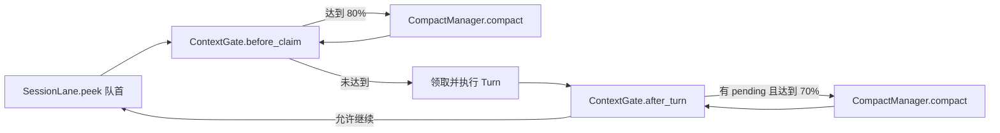

# PRD-B2-CompactManager

> 状态生命周期：草稿 → 评审 → approved（定稿）→ 开发中 → 已验收

## 元信息

| 字段 | 值 |
|---|---|
| 阶段 | B2 |
| 名称 | CompactManager 上下文压缩（should_compact + compact + compress-fast + idle 策略） |
| 状态 | 已验收 |
| 创建日期 | 2026-08-12 |
| 定稿日期 | 2026-08-12 |
| 验收日期 | 2026-08-12 |
| 关联文档 | docs/TODO.yaml 阶段 B2；AGENTS.md |

## 1. 背景与目标

- **背景**：随着对话轮次增加，上下文窗口会溢出（token 数超过模型限制）。需要 LLM 压缩摘要机制，将历史消息折叠为摘要，释放上下文空间。同时需要零 LLM 的快速裁剪方案处理 ToolResultBlock 等大体积内容。
- **目标**：实现 CompactManager——水位判断触发压缩、LLM 摘要压缩、手动 `/compact` 和 `/compress-fast` 命令、共享 Task 去重防止重复压缩。
- **非目标**：不实现 TurnExecutor 的单轮状态机（B3）、不拥有 Mailbox/FIFO/状态编排（B1）。压缩结果由 AgentLoop 通过既有 outbound 事件和快照对外发布；CompactManager 不直接操作前端。

## 2. 需求范围

### 2.1 功能需求

- [x] FR1：should_compact 水位判断——检查当前上下文 token 数是否超过阈值（threshold），超过则触发压缩
- [x] FR2：compact LLM 摘要——调用 LLM 将历史消息压缩为摘要锚点，保留原始 messages，下一轮上下文从最新锚点和 tail 构建
- [x] FR3：`/compact` 手动压缩——用户发送 `/compact` 命令手动触发 LLM 压缩
- [x] FR4：`/compress-fast` 零 LLM 裁剪——不调用 LLM，直接裁剪 ToolResultBlock 等大体积内容，快速释放空间
- [x] FR5：共享 Task 去重——同一 session 的压缩请求复用同一个 asyncio.Task，不重复执行
- [x] FR6：cancel_compact——会话关闭/网关停止时取消正在进行的真实压缩任务；普通 `/cancel` 不取消共享压缩
- [x] FR7：压缩事件投影——summary/fast 结果通过 `context_compact_done` 进入 SessionProjection，CompactManager 不直接写 state.json 或发送 WebSocket

### 2.2 非功能需求

- 性能：compress-fast 耗时 < 100ms（无 LLM 调用）
- 安全：压缩不丢失 UserMessage 和最近 N 轮 AssistantMessage
- 兼容性：压缩后的摘要消息标记 `compressed: true`，可被识别

## 3. 技术方案

### 模块设计

| 文件 | 职责 |
|---|---|
| `src/ftre/agent/compact_manager.py` | `CompactManager`，should_compact + compact + compress-fast + Task 去重 |
| `src/ftre/agent/compact_events.py` | 压缩相关事件定义（CompactStartEvent / CompactEndEvent） |

### 关键数据结构

```python
class CompactManager:
    threshold: float             # 比例水位，如 0.8
    _tasks: dict[str, asyncio.Task]  # session_id → 唯一真实压缩 Task

    async def should_compact(self, session_id: str) -> bool: ...
    async def compact(self, session_id: str, channel_id: str, *, config, trigger: str = "auto") -> str | None: ...
    async def compress_fast(self, session_id: str, channel_id: str, *, config, keep_turns: int = 0) -> bool: ...
    async def cancel_compact(self, session_id: str) -> bool: ...
```

水位计算使用可用 prompt 预算，而不是直接拿完整 context window 比例：

`prompt_budget = context_window - max_output - safety_buffer`

`should_compact` 以最近一次真实 token usage 为锚点；没有 usage 时退化为字符估算。
领取前还要加上队首 QueueItem 的估算 token，避免“当前历史未超线、领取后立即溢出”。

### 3.1 结果语义

- summary 成功：写入一条 `name=compact`、`metadata.hide=true` 的 UserMsg，带 `through_message_id` 上下文锚点。
- fast 成功：裁剪旧 ToolResultBlock，并写入一条 `name=compact_fast` 的 AssistantMsg 提示；它不是上下文锚点。
- 没有可压缩内容：返回 no-op，不生成假的 compact Msg。
- LLM 失败、摘要为空或摘要膨胀：不写 compact 摘要，交由 ContextGate 决定 fast fallback 或 blocked。
- 同一 session 只允许一个真实压缩 Task；等待者取消不会中断共享 Task，只有 close/stop 才可取消真实 Task。

## 4. 在 SessionLane 中的调用位置

CompactManager 是压缩算法和共享任务的所有者，但不决定“什么时候允许下一条消息”。
这个编排职责属于 B1 的 `ContextGate` 和 `SessionLane`：



- 领取前压缩时，队首仍留在 `Mailbox.pending`，压缩完成后才 `take`，因此不会提前进入 LLM context。
- 一轮完成后，若仍有 pending 且达到预压缩水位，必须等待压缩结束再领取下一条。
- 失败处理由 `ContextGate` 统一编排：先重算，必要时尝试 `compress_fast`；仍不安全则将 Lane 置为 `blocked`，保留队首，禁止盲目继续。
- CompactManager 内部对同一 session 复用共享 Task，保证自动压缩、手动 `/compact` 和其他触发源不会并发写历史。

## 5. 验收标准

- [x] AC1：水位 ≥ threshold 触发压缩——上下文 token 数超过阈值时自动触发 compact
- [x] AC2：共享 Task 不重复——同一 session 并发触发两次压缩，只执行一次 LLM 调用
- [x] AC3：compress-fast 裁剪 ToolResultBlock——执行后 ToolResultBlock 被替换为占位摘要，不调用 LLM
- [x] AC4：summary 投影——压缩摘要通过 Projection 落入 messages，原始历史不删除，下一轮上下文从最后一条 compact 锚点和 tail 构建
- [x] AC5：压缩无副作用——无新 tail 或无可裁剪 ToolResultBlock 时 no-op，不生成重复展示消息
- [x] AC6：失败安全——LLM 失败/摘要过大不写错误摘要；ContextGate 复核后可 fast fallback，仍超硬水位则 blocked

## 6. 测试计划

- `tests/test_compact_algo.py`：ToolResultBlock 裁剪、keep_turns、无可裁剪内容。
- `tests/test_compact_summary.py`：summary/fast Projection、through_message_id、压缩期间到达的消息留在 tail、共享 Task 去重和失败不写摘要。
- `tests/test_context_config.py`：precompact_threshold、compact_threshold、safety_buffer 和 legacy 配置映射。
- `tests/test_session_lane.py`：before_claim 80%、after_turn 70% 门控与 pending 保留。

## 7. 变更记录

| 日期 | 变更 | 原因 |
|---|---|---|
| 2026-08-13 | 补充 ContextGate 的 80% 领取前与 70% 回合后门控，以及 CompactManager 与 SessionLane 的职责边界 | 说明压缩如何嵌入队列流水线，避免误以为 TurnExecutor 或 CompactManager 直接消费队列 |
| 2026-08-13 | 补充实际 prompt 预算公式、summary/fast/no-op/failure 语义、事件投影和测试计划；修正 CompactManager API 示例 | 将压缩结果、失败处理和上下文锚点变成可验收的契约 |
| 2026-08-13 | 影响复核：Compact/Context/Lane 定向测试通过，覆盖 summary、fast、no-op、共享 Task 和压缩期间 tail；ContextGate 的失败后 blocked 集成路径仍需补测 | 记录压缩边界和失败语义的验收依据 |
