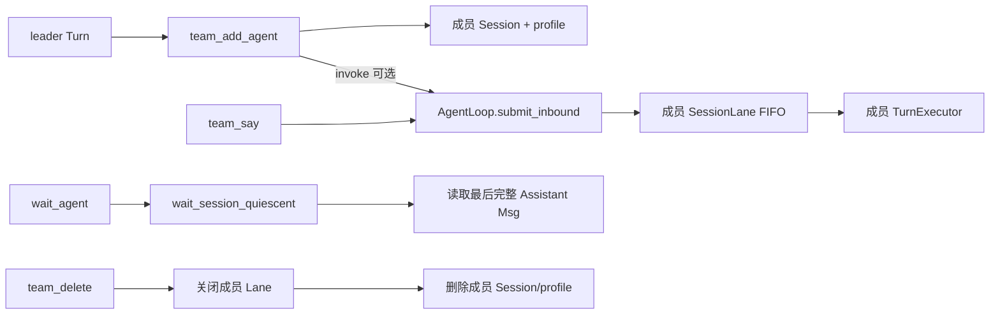

# PRD-C3-多Agent协作

> 状态生命周期：草稿 → 评审 → approved（定稿）→ 开发中 → 已验收

## 元信息

| 字段 | 值 |
|---|---|
| 阶段 | C3 |
| 名称 | 多 Agent 协作（team 工具集 + AgentManager + sub_agent_profile + per-agent 配置目录） |
| 状态 | 已验收 |
| 创建日期 | 2026-08-12 |
| 定稿日期 | 2026-08-12 |
| 验收日期 | 2026-08-12 |
| 关联文档 | docs/TODO.yaml 阶段 C3；AGENTS.md |

## 1. 背景与目标

- **背景**：复杂任务需要多 Agent 团队协作——leader 组建团队、派发任务、成员并行执行、等待汇总。同时每个 agent 需要独立配置目录（人设、规则、偏好、私有 skill），AgentManager 负责配置合并。
- **目标**：实现完整的 team 工具集 + AgentManager 配置合并 + per-agent 配置目录结构，支持团队全流程（创建→派活→等待→解散）。
- **非目标**：不实现 MCP 私有配置（C2）、不实现团队调度算法优化。

## 2. 需求范围

### 2.1 功能需求

- [x] FR1：team_create——创建团队，返回 team_id，团队挂在当前会话下
- [x] FR2：team_add_agent——向团队添加成员 agent，创建独立 session + 持久化 AgentProfile，可选立即执行首任务
- [x] FR3：team_say——给成员发送消息/派发新任务（异步，不阻塞）
- [x] FR4：wait_agent——等待一批成员完成当前任务（阻塞，类似 Promise.all）
- [x] FR5：team_agent_status——查看成员最新执行状态（单个或全部）
- [x] FR6：team_delete——解散团队并级联删除所有成员 session
- [x] FR7：AgentManager 配置合并——`_load_and_merge` 实现 llm/tools/workspace/mcp/plugins/disabled_skills 合并规则
- [x] FR8：per-agent 配置目录——`~/.ftre/agents/<agent_id>/` 含 agent.config.json、SOUL.md、AGENTS.md、USER.md、skills/
- [x] FR9：团队消息与 SessionLane 对齐——team_say/首个 invoke 走成员 Session 的 durable admission；wait_agent 等待成员队列 quiescent，而不是等待一个模糊的 session 级完成事件

### 2.2 非功能需求

- 性能：成员 agent 异步并行执行，不阻塞 leader
- 安全：subagent 内禁止调用 task/send_message/cron 工具
- 兼容性：agent 配置合并规则稳定，新增字段不影响已有 agent

## 3. 技术方案

### 模块设计

| 文件 | 职责 |
|---|---|
| `src/ftre/tools/team.py` | team 工具集——team_create/add_agent/say/wait_agent/agent_status/delete |
| `src/ftre/agent/agent_manager.py` | `AgentManager`——配置加载 + 合并 + `_build_agent` |
| `src/ftre/agent/sub_agent_profile.py` | `SubAgentProfile`——成员 profile 持久化（role 写入 AGENTS.md，其余写入 agent.config.json） |

### 关键数据结构

```python
# per-agent 配置目录结构
~/.ftre/agents/<agent_id>/
  ├── agent.config.json    # LLM、tools、workspace、mcp、plugins、disabled_skills
  ├── SOUL.md              # 人设（追加到全局 system_prompt 之后）
  ├── AGENTS.md            # 项目约定（context_govern 注入）
  ├── USER.md              # 用户偏好（追加到 SOUL.md 之后）
  └── skills/              # Agent 私有 Skill（同名覆盖全局）

# 配置合并规则
# llm:            provider + model 可覆盖，api_key/base_url/vision 始终用全局
# tools:          整体替换（写了就用 agent 的，不写则全部可用）
# workspace:      Agent 的"家目录"
# mcp:            深度合并（按 server name 为 key，agent 覆盖全局）
# plugins:        按 name 合并（同名 agent 覆盖全局，全局有但 agent 没提的保留）
# disabled_skills: 整体替换
```

## 4. 团队与 SessionLane 的协作边界



- 成员 Session 与 leader Session 是独立 Lane，可以并行；同一成员的多次 team_say 仍严格 FIFO。
- `team_add_agent(invoke=...)` 和 `team_say` 返回的是 `request_id/queue_position` 接纳信息，不代表成员已经完成。
- `wait_agent` 等待指定成员的当前 Turn、轮后压缩和 pending 全部清空，再从持久历史读取最终文本；队列中多条消息不能被第一条完成提前唤醒。
- `team_delete` 必须先关闭成员 Lane、停止 active/compact，再删除 Session 和 profile；不能只删目录后让旧 worker 继续写盘。

## 5. 验收标准

- [x] AC1：团队创建/派活/等待/解散全流程——team_create 创建团队 → team_add_agent 添加成员 → team_say 派活 → wait_agent 等待完成 → team_delete 解散
- [x] AC2：agent 配置正确合并——llm 的 provider/model 可覆盖、tools 整体替换、mcp 深度合并、plugins 按 name 合并
- [x] AC3：成员 profile 持久化——成员 agent 的 role 写入 AGENTS.md，其余配置写入 agent.config.json，重启后可恢复

## 6. 测试计划

- `tests/test_session_lane.py`：成员 Session 的 FIFO、取消和 quiescent 基础行为。
- 团队工具自动化测试待补：team_create/add_agent/say/wait/delete 的 request_id 关联、队列多消息等待和删除竞态。
- 手动验收：成员 A 执行期间连续 team_say B/C，wait_agent 只能在 A/B/C 全部结束后返回；删除团队时不再接纳新成员消息。

## 7. 变更记录

| 日期 | 变更 | 原因 |
|---|---|---|
| 2026-08-13 | 补充 team 工具与 SessionLane 的 durable admission、quiescent 等待、成员并行和删除收尾边界 | 将多 Agent 协作从“工具调用流程”提升为可审计的跨 Session 生命周期契约 |
| 2026-08-13 | 影响复核：新增 FR9/协作测试计划；AC1-AC3 的配置/profile 范围不变，team 队列竞态自动化测试仍待补 | 诚实区分已有证据与待验证行为 |
