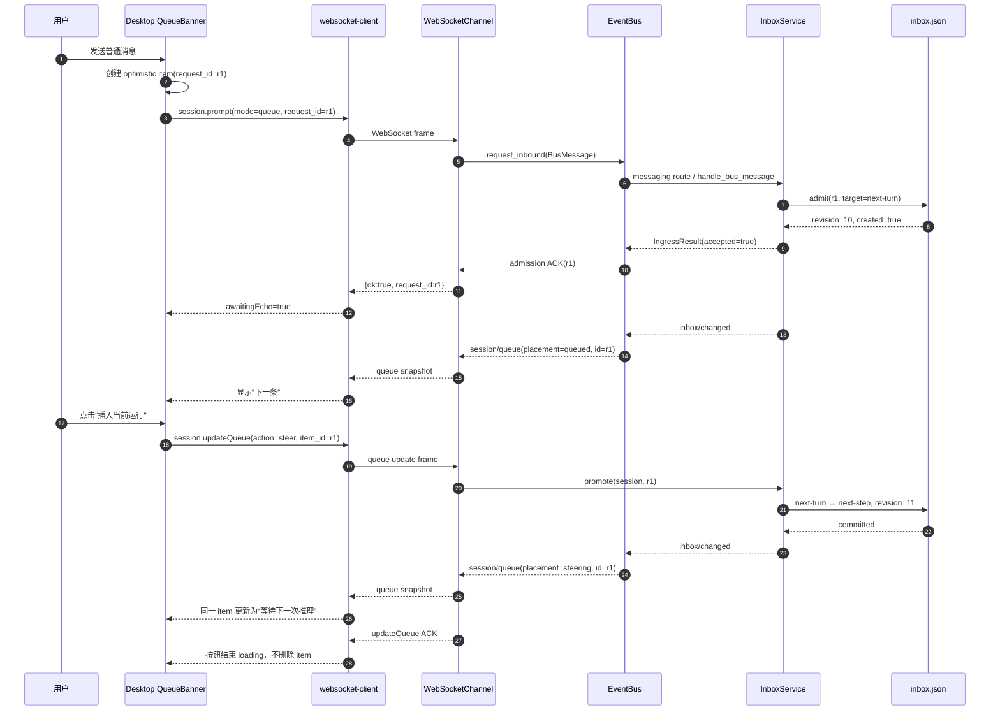
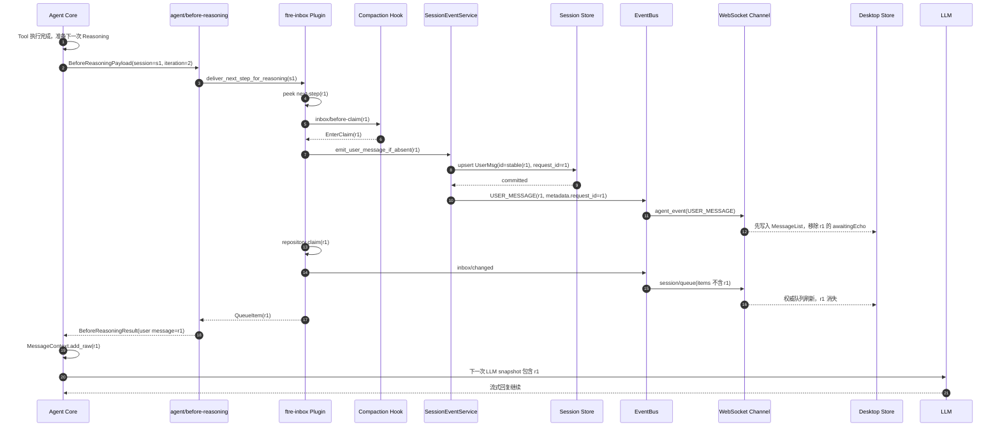

# PRD-F22 运行中 Steering 消息注入与协议闭环

## 元信息

| 字段 | 值 |
|---|---|
| 阶段 | F22 |
| 名称 | 运行中 Steering 消息注入与协议闭环 |
| 状态 | 已验收 |
| 创建日期 | 2026-08-24 |
| 定稿日期 | 2026-08-24 |
| 验收日期 | 2026-08-24 |
| 关联文档 | `docs/TODO.yaml` 阶段 F22；`PRD-F12-session-inbox-protocol.md`；`PRD-F15-hook-surface-convergence.md`；`PRD-F21-command-ingress-async.md`；`AGENTS.md`；`docs/PROCESS.md` |
| 参考代码 | `packages/ftre-inbox`；`src/ftre/plugins/builtin/channels/websocket`；`src/ftre/services/agent/runtime`；`E:\\ftre-agent-core` 的 `agent/before-reasoning` |

> 本文是第一版 PRD，已进入开发并按下述验收标准实现。
> F22.1–F22.4 在 `E:\\ftre` 完成 Host/Package；F22.5–F22.6 在配套的
> `E:\\binn\\ftre-desktop` 独立客户端分支完成，不把客户端源代码混入 ftre 后端提交。

> 当前协议以 F24 为准：本阶段描述的 Steering 语义、DB-first 交接和 `message_id` 边界
> 仍有效，但旧 admission ACK 与后续 `session/queue` 对账流程已被 Queue Operation
> Response 取代，不能作为新代码的 wire 契约。

## 1. 背景与问题

### 1.1 用户目标

用户希望在 Agent 已经运行时继续发送一条消息，并能够明确选择这条消息的处理语义：

```text
queue：等待当前 Turn 完成，作为下一次 Agent Turn 的正式输入；
steer：插入当前正在运行的 Agent，在下一次 Reasoning 前进入 LLM 上下文；
inject：仅供内部 Plugin 注入上下文，不唤醒空闲 Agent，也不代表浏览器用户输入。
```

目标不是打断当前正在执行的 LLM 或 Tool，而是在 Core 已经发布的
`agent/before-reasoning` 边界完成安全、可审计、可恢复的注入。

### 1.2 当前代码事实

当前 ftre 已有一条“半完成”的 Steering 链路：

```text
InboxService.steer()
  → next-step
  → agent/before-reasoning
  → claim_next_step_for_reasoning()
  → BeforeReasoningResult
  → Core MessageContext.add_raw()
```

`packages/ftre-inbox/tests/test_plugin_hook.py` 已证明直接调用
`InboxService.steer()` 时，Tool 完成后下一次 LLM 可以读到 Steering 内容。

但是从真实 WebSocket 到 Inbox 的协议链路存在以下问题：

1. WebSocket 接入层允许 `mode=steer`，但 `InboundData` 没有 `mode` 字段；
   `InboundData.coerce(...).model_dump()` 会把未知字段丢弃；
2. `InboxService.handle_bus_message()` 读取不到 `mode` 后默认使用 `queue`，
   所以客户端发送的 Steering 实际落入 `next-turn`；
3. 桌面端 `sendChat()` 当前固定发送 `mode: "queue"`，没有高层 Steering API；
4. `next-step` 被 Core 注入后只进入当前 `AgentState.context`，没有正式写入 Session
   UserMessage 历史，用户消息可能在界面和后续上下文中消失；
5. 当前 `claim` 会先从 Inbox 删除项目，再把结果交给 Hook；进程在 claim 后、Core
   注入前崩溃时，消息没有 pending，也没有 Session 历史，存在丢失窗口；
6. 现有测试覆盖了 Package 直连 Hook，但没有覆盖“真实 WebSocket frame →
   InboundData → BusMessage → Inbox”这条数据路径。

### 1.3 现象与证据

以如下帧为例：

```json
{
  "type": "session.prompt",
  "request_id": "req-steer-001",
  "payload": {
    "session_id": "ws_sess_demo",
    "mode": "steer",
    "content": "请停止搜索，改用中文回答",
    "attachments": []
  }
}
```

WebSocket 内部曾经拥有 `mode=steer`，但经过当前 `InboundData` 归一化后实际变成：

```json
{
  "content": "请停止搜索，改用中文回答",
  "session_id": "ws_sess_demo",
  "attachments": []
}
```

随后 `handle_bus_message()` 执行 `message.data.get("mode") or "queue"`，最终写入：

```json
{
  "next_turn": [
    {
      "request_id": "req-steer-001",
      "target": "next-turn"
    }
  ],
  "next_step": []
}
```

这不是客户端显示问题，而是接入协议字段在 Host 内部被静默丢弃。

## 2. 目标与非目标

### 2.1 目标

本阶段完成后：

1. `session.prompt` 的 `mode` 在 WebSocket、Bus、Inbox 之间完整传递；
2. 旧客户端不发送 `mode` 时默认保持 `queue`，不破坏兼容行为；
3. 真实 `mode=steer` 在 active Turn 存在时进入 `next-step`，在下一次
   `agent/before-reasoning` 前只消费一次；
4. Steering 消息作为用户输入时，在成功交付前后拥有明确的 Session 历史语义，
   不再出现“影响模型但聊天历史没有消息”的隐式行为；
5. 持久化、claim、重试、取消和 Gateway 重启不会静默丢失或重复消费 Steering；
6. 当前 `queue`、`inject`、Command、Compaction 和 Tool 行为保持不变；
7. 不增加 AgentService 的 Queue API，不把 Inbox 模型传入 Agent Core；
8. 不依赖客户端改动即可通过原始 WebSocket 测试完整验证 Host 协议。

### 2.2 非目标

- 不在本阶段打断当前 LLM stream；
- 不在本阶段强制取消正在执行的 Tool；
- 不把 `steer` 变成第二个 Agent Loop 或并发 Turn；
- 不把 `QueueItem`、pending、revision、claim 传入 AgentService 或 Agent Core；
- 不新增 `AgentControlPort`、`QueueCoordinator`、Service Bag、全局 setter 或兼容 Facade；
- 不修改 Agent Core 的 `agent/before-reasoning` 契约；现有 Hook 已足够表达本阶段能力；
- F22.1–F22.4 不直接修改 `E:\\binn\\ftre-desktop`；F22.5–F22.6 通过独立客户端 PR
  完成按钮和无卡顿交互，不把两个仓库的 Owner 混进同一提交；
- 不把所有 Steering 自动追加到历史，内部 `InboxService.inject()` 仍然可以保持临时
  Plugin 上下文语义；本阶段只明确浏览器用户 `session.prompt(mode=steer)` 的语义；
- 不把 Session 持久化整体改造成事件溯源或引入新的消息数据库。

## 3. 术语与所有权

### 3.1 消息语义

| 语义 | 入队目标 | 是否唤醒 worker | active Turn 存在时 | active Turn 不存在时 | 历史语义 |
|---|---|---|---|---|---|
| `queue` / `followup` | `next-turn` | 是 | 等当前 Turn 完成后新建 Turn | 新建 Turn | 正式 UserMessage |
| `steer` | `next-step` | 是 | 下一次 Reasoning 前注入当前 Turn | 作为新 Turn 的首条输入 | 正式 UserMessage |
| `inject` | `next-step` | 否 | 由 Plugin Hook 注入 | 不启动 Turn | 临时上下文，默认不落正式历史 |

`steer` 不表示“立即抢占”。如果当前 LLM 或 Tool 尚未到达下一次
`agent/before-reasoning`，消息继续保存在 Inbox；当前 Turn 自然结束后，如果没有可用的
Reasoning 边界，则按照明确的 fallback 作为下一次 Turn 执行，不能丢弃。

### 3.2 Owner

```text
ftre-inbox Package
  - mode 解析后的 admission
  - next-turn / next-step 持久化
  - request_id 幂等和容量限制
  - peek → policy Hook → delivery/claim
  - active Turn 的 next-step 消费
  - Steering 交付事务和 Inbox 恢复

SessionService
  - 正式 UserMessage 历史
  - request_id 幂等的历史写入事实
  - 对外 Session projection

AgentService / AgentLoop
  - 接收已交付 InboundMessage
  - active Turn 互斥、取消和生命周期 Hook
  - 不知道 QueueItem、next-step、pending 或 Inbox revision

Agent Core
  - 发布 agent/before-reasoning
  - 接收 Provider 无关的 mapping 消息
  - 不知道 WebSocket、Inbox、Session Repository 或用户协议

WebSocket Channel Plugin
  - 解析线协议并构造 BusMessage
  - 返回 admission ACK
  - 不保存队列、不实现 Steering claim
```

依赖方向保持：

```text
WebSocket Channel → MessageBus → ftre-inbox → AgentService → Agent Core
                                      │
                                      └→ SessionService（正式 Steering 历史）
```

## 4. 需求范围

### 4.1 线协议与数据保真

- [x] **FR1：InboundData 显式声明 mode**
  - `mode` 是 `Literal["queue", "steer"]`；缺省值为 `"queue"`；
  - `InboundData.coerce()` 不得静默丢弃合法 `mode`；
  - 未知 mode 必须在接入边界明确拒绝，不能静默降级为 queue；
  - `InboundMetadata` 的 request_id 仍由顶层 frame 构造，客户端 metadata 不得覆盖；
  - attachments、content、session_id 的现有归一化不变。

- [x] **FR2：WebSocket 到 Inbox 的 mode 保真**
  - 原始 `session.prompt(mode="steer")` 经过 `_admit()`、`BusMessage.data` 和
    `InboxService.handle_bus_message()` 后必须调用 `steer()`；
  - 原始客户端未携带 mode 的旧帧必须调用 `followup()`；
  - ACK 只代表 Inbox 已完成 durable admission，不代表 Agent 已完成消费；
  - ACK 的 request_id 必须与原始 frame 完全一致。

- [x] **FR3：服务端内部调用也使用同一语义**
  - `Channel.receive()`、Package 投递和 WebSocket 入口不得各自定义一套 mode 字符串；
  - `InboundData` 是 Host 线协议唯一事实源；
  - 不新增平行的 `SteerMessage`、`QueueMessage` 或转换 Facade。

### 4.2 Steering 交付

- [x] **FR4：active Turn 的下一次 Reasoning 注入**
  - active Turn 存在时，`steer` 进入 `next-step`；
  - `agent/before-reasoning` 是唯一消费边界；
  - 一次 Hook 调用可以按 sequence 批量消费多个 next-step；
  - 同一个 request_id 在同一个 Turn 中最多出现在一次 LLM snapshot；
  - 消费顺序保持 Inbox sequence 顺序；
  - 消费不启动第二个 Agent Turn，不调用 `AgentService.run()`。

- [x] **FR5：Tool、LLM stream 和自然结束边界**
  - Tool 正在执行时接纳的 Steering 必须保持 pending，直到 Tool 完成并进入下一次
    Reasoning；
  - 当前 LLM stream 中接纳的 Steering 不修改已经发送给 Provider 的 messages 快照；
  - 如果当前 Turn 在 Steering 到达前自然结束且不再触发 Reasoning，消息必须转入明确的
    fallback：作为下一个独立 Turn 执行；
  - 不允许因为“没有下一次 Reasoning”而删除或静默吞掉 Steering。

- [x] **FR6：空闲 Session fallback**
  - active Turn 不存在时，`steer` 不得停留在永远不会被 Hook 消费的 next-step；
  - Inbox worker 必须将它交付为新的 `InboundMessage` Turn；
  - 同一 Session 仍最多一个 active Turn，不同 Session 可以并行。

### 4.3 历史、幂等与恢复

- [x] **FR7：用户 Steering 的历史事实**
  - `session.prompt(mode="steer")` 被定义为正式用户输入；
  - 在 `BeforeReasoningResult` 返回前，必须确保该输入已经以 request_id 幂等地写入
    Session UserMessage 历史，或进入一个可恢复的交付状态；
  - 如果当前 Reply 已经产生 assistant 输出，Session 必须在该输出与 Steering UserMessage
    之间建立 transcript segment 边界；后续同一 Core `reply_id` 的输出不能越过该 UserMessage
    回写到前一个 assistant segment；
  - Session projection 应能向客户端发布该 UserMessage，顺序不应晚于对应 Agent 回复的
    终态事实；
  - 内部 `InboxService.inject()` 保持临时 Plugin 上下文语义，不强制写正式用户历史；
  - 历史 UserMessage 不得因为再次重连、Hook 重试或同 request_id 重发而重复。

- [x] **FR8：交付事务不能静默丢失**
  - 现有“先 claim、后注入”的丢失窗口必须消除；
  - Session 持久化失败、Hook 失败或 Core 取消时，消息要么继续处于 Inbox 可恢复状态，
    要么已经存在幂等的历史事实；
  - 进程在交付中崩溃后重启，不能出现“pending 已删除、历史不存在、客户端无诊断”的状态；
  - 允许沿用 at-most-once 的 Agent Tool 执行策略，但用户 Steering 的 admission 和历史
    事实必须可恢复。

- [x] **FR9：重复请求与竞争操作**
  - 相同 `(session_id, request_id)` 重发必须返回同一 admission 事实，不重复创建 QueueItem；
  - edit/remove 与 Steering claim 竞争时只有一个操作成功；
  - 已消费的 Steering 再次通过相同 request_id 到达，不得重新注入；
  - cancel active 不得删除尚未消费的 next-step；取消 pending 仍由 Inbox 的 remove 负责。

### 4.4 Hook 与架构边界

- [x] **FR10：复用既有 Hook，不增加 Core 控制类型**
  - 继续使用 Core 已有的 `agent/before-reasoning` 和 `BeforeReasoningResult`；
  - Inbox Package 通过 Hook listener 消费 next-step；
  - 不向 AgentService 增加 `steer()`、`inject()`、`submit_queue()` 等队列 API；
  - 不让 Agent Core import `ftre-inbox` 或读取 QueueItem；
  - 不新增 `CompactionPort`、`AgentControlPort`、`QueueCoordinator` 或第二套 dispatcher。

- [x] **FR11：生命周期可逆**
  - Inbox 的 Steering Hook listener、worker、Session listener 都绑定 Plugin Fiber/Effect；
  - unload/restart 时不残留 Hook、worker 或 in-flight delivery；
  - Hook 正在执行时卸载必须等待已进入的异步交付完成或返回明确取消诊断；
  - 关闭时 pending 文件保留供下次启动恢复。

### 4.5 协议兼容与客户端边界

- [x] **FR12：旧客户端兼容**
  - 不发送 mode 的旧 `session.prompt` 仍按 `queue` 执行；
  - 现有 `session/queue`、`session/status`、admission ACK 结构不无故改名；
  - 服务端可以先通过原始 WebSocket 验证 Steering，不要求本阶段修改桌面端。

- [x] **FR13：冻结客户端消费契约**
  - 提供客户端可使用的 `sendChat(content, metadata, attachments, frameId, mode)` 等价
    协议说明，但本阶段不直接改 `E:\\binn\\ftre-desktop`；
  - 客户端后续可以选择：普通发送使用 queue、明确“插入当前运行”操作使用 steer；
  - 服务端不得根据客户端 UI 状态猜测 mode，必须使用 wire payload 的显式字段。

## 5. 目标数据流

### 5.1 正常 Steering

```text
客户端 session.prompt
  {
    type: "session.prompt",
    request_id: "req-steer-001",
    payload: {
      session_id: "ws_sess_demo",
      mode: "steer",
      content: "请停止搜索，改用中文回答"
    }
  }
        │
        ▼
WebSocket Channel
  - 校验 mode
  - InboundMetadata.from_client()
  - 顶层 request_id 写入 metadata
        │
        ▼
BusMessage
  type: "user_message"
  data: {
    session_id,
    mode: "steer",
    content,
    attachments
  }
  metadata: {request_id, agent_id}
        │
        ▼
InboxService.handle_bus_message()
  - mode=steer
  - repository.admit(..., target="next-step")
  - inbox.json 原子写入
  - 返回 admission ACK
        │
        ├─ active Turn 存在：worker 等待，不启动第二个 Turn
        │
        ▼
Core agent/before-reasoning
  - Inbox Hook 做 before-claim policy
  - 以 request_id/sequence 原子取得 next-step
  - 确认正式 UserMessage 历史已幂等提交
        │
        ▼
BeforeReasoningResult
  messages=(
    {"role": "user", "content": "请停止搜索，改用中文回答"},
  )
        │
        ▼
Core MessageContext
  - 追加到当前 AgentState.context
  - 下一次 LLM snapshot 可见
        │
        ▼
LLM / Tool / Assistant 输出
```

### 5.2 当前错误数据流（必须被回归测试锁定并修复）

```text
payload.mode="steer"
  ↓
InboundData.coerce()
  ↓  mode 是未知字段，被静默丢弃
BusMessage.data 没有 mode
  ↓
Inbox.handle_bus_message()
  ↓  message.data.get("mode") or "queue"
next-turn
```

### 5.3 Steering 与 queue 的对比

```text
steer / active Turn
  admission → next-step → before-reasoning → 当前 Turn 下一次 LLM

queue / active Turn
  admission → next-turn → 等 active Turn 结束 → 新 Agent Turn

steer / idle Session
  admission → next-step → Inbox worker fallback → 新 Agent Turn
```

## 6. 接口定义

### 6.1 `session.prompt` 入站帧

```json
{
  "type": "session.prompt",
  "request_id": "req-steer-001",
  "payload": {
    "session_id": "ws_sess_demo",
    "mode": "queue | steer",
    "content": "string 或 text parts",
    "attachments": []
  },
  "metadata": {
    "agent_id": "default"
  }
}
```

约束：

- `request_id` 是顶层传输幂等标识；
- `payload.mode` 缺省为 `queue`；
- `metadata.request_id` 不由客户端控制；
- `agent_ref` 仍禁止由客户端构造；
- `mode` 不是自由字符串，非法值返回 `invalid_mode`。

### 6.2 admission ACK

```json
{
  "request_id": "req-steer-001",
  "ok": true,
  "value": {
    "accepted": true,
    "session_id": "ws_sess_demo",
    "created": true
  }
}
```

ACK 的语义是：

```text
消息已被 Inbox durable admission 接纳
≠ 当前 LLM 已经看到消息
≠ Agent Turn 已经完成
```

### 6.3 `BeforeReasoningResult`

Core 继续只接收 Provider 无关的 mapping：

```python
BeforeReasoningResult(
    messages=(
        {
            "role": "user",
            "content": "请停止搜索，改用中文回答",
        },
    ),
)
```

不得把 `QueueItem`、`InboundMessage` 或 SessionService 对象放入 Core Hook payload。

## 7. 非功能需求

- **正确性**：ACK 前必须 durable；Steering 不得因 mode 丢失、Hook 失败、重启或重复请求
  静默丢失；同一请求最多注入一次。
- **并发性**：不同 Session 可并行；同一 Session 只有一个 active Turn；同一批 next-step
  的 sequence 顺序稳定。
- **延迟**：admission ACK 不等待 LLM、Tool 或正式 Turn 完成；active Steering 只等待下一个
  合法 Reasoning 边界。
- **可观测性**：至少能通过 `session/queue`、Session UserMessage、Turn 事件和 Hook 诊断区分
  “已接纳”“待注入”“已注入”“作为新 Turn fallback”。
- **安全性**：客户端只能构造 queue/steer 和 agent_id 白名单字段，不得注入 agent_ref 或
  任意 Session 路由。
- **兼容性**：无 mode 的旧客户端行为保持 queue；`inject` 的内部 Plugin 语义不改变。
- **卫生**：不产生新的兼容目录、空目录、临时缓存、第二套 DTO 或未绑定的后台任务。

## 8. 验收标准

- [x] **AC1：mode 线协议保真**
  - 使用真实 WebSocket `session.prompt(mode="steer")`；
  - 断言 `BusMessage.data["mode"] == "steer"`；
  - 断言 Inbox 调用 `steer()`，持久化目标为 `next-step`；
  - 断言旧帧缺省 mode 仍落 `next-turn`。

- [x] **AC2：active Tool 后注入**
  - 启动一个会阻塞的 Tool；
  - WebSocket 发送 Steering 并收到 durable ACK；
  - 释放 Tool；
  - 断言下一次 LLM messages 恰好包含一次 Steering，Inbox pending 已清除，未创建第二个
    Agent Turn。

- [x] **AC3：active LLM stream 不被修改**
  - 在 LLM stream 尚未结束时发送 Steering；
  - 断言当前调用的 messages 快照不被原地修改；
  - 断言下一个合法 Reasoning 或 fallback Turn 只消费一次该消息。

- [x] **AC4：自然结束 fallback**
  - 在最后一次 Reasoning 完成、stop-decision 之前/之后分别注入 Steering；
  - 断言没有下一次 Reasoning 时消息不会丢失；
  - 断言消息最终作为下一次独立 Turn 执行或被明确的交付状态保留。

- [x] **AC5：正式历史**
  - `session.prompt(mode="steer")` 成功交付后，Session projection 能看到一条对应
    request_id 的 UserMessage；
  - 消息顺序为“前半段 assistant → Steering UserMessage → 后半段 assistant”，与其在当前
    上下文中的位置一致；刷新/重连后仍保持该顺序；
  - 同 request_id 重发、Hook 重试和 WebSocket 重连不会重复历史。

- [x] **AC6：失败与重启恢复**
  - 在 claim、历史写入、Hook 返回和 Core 取消点注入故障；
  - 断言消息要么仍在 Inbox 可恢复，要么已存在幂等历史事实；
  - 重启 Gateway 后不会出现 pending 与历史同时不存在的消息。

- [x] **AC7：多 Session 隔离**
  - 同时运行两个 Session；
  - Steering 只能进入自己的 Session/Agent scope；
  - 不能被其他 Session 的 `before-reasoning` 消费。

- [x] **AC8：旧语义不回归**
  - `queue` 仍在 active Turn 结束后创建新 Turn；
  - `inject` 仍不唤醒空闲 Agent；
  - Command 不进入 Inbox；
  - Compaction 的 `inbox/before-claim` 仍可阻止 claim 并保留 pending。

- [x] **AC9：生命周期**
  - Inbox unload/restart 不残留 worker、Hook listener 或 in-flight delivery；
  - Hook in-flight 时等待屏障符合现有 HookRuntime 语义；
  - pending 文件可以被下一次 Composition 恢复。

- [x] **AC10：工程门禁**
  - `python -m pytest -q`；
  - `python -m ruff check src tests packages`；
  - `git diff --check`；
  - architecture/contracts/startup/lifecycle 专项通过；
  - F22.1–F22.4 不修改 `E:\\binn\\ftre-desktop`、`E:\\ftre-agent-core`、`E:\\cordis-py`；
    F22.5–F22.6 的客户端测试在独立仓库执行。

- [x] **AC11：队列升级按钮**（客户端 PR）
  - 用户发送普通消息后，消息先以 `placement="queued"` 出现在队列横幅；
  - 用户点击“插入当前运行”按钮后，客户端发送
    `session.updateQueue(action={"kind":"steer"})`，不创建第二条消息；
  - 服务端 ACK 成功后，`session/queue` 权威快照将同一 request_id 的 placement 更新为
    `steering`；按钮进入处理中状态，失败时保持 queued 并显示可重试错误；
  - 客户端不得在收到权威快照前乐观删除该队列项。

- [x] **AC12：Steering 消费无视觉空窗**（跨仓 E2E）
  - Tool 完成后，Core 进入下一次 `agent/before-reasoning`；
  - Steering 消息先完成 Session UserMessage 持久化，再向客户端发送 `USER_MESSAGE`；
  - 客户端收到 `USER_MESSAGE` 后立即把消息移入 MessageList，并按 request_id 移除队列项；
  - 随后的 `session/queue` 快照必须确认该项已不再 pending；
  - 消费期间 Agent 继续正常运行，不暂停输入框、不重置 Session、不出现“消息消失后再出现”
    的视觉空窗。

## 9. 测试计划

### 9.1 协议与单元测试

- `InboundData.coerce()` 保留 queue/steer，缺省 queue，拒绝非法值；
- `BusMessage` 的 data/metadata/request_id 形状和未知字段边界；
- `InboxService.handle_bus_message()` 在 mode 两种取值下分别调用 followup/steer；
- `QueueItem` 的 next-turn/next-step 持久化、幂等、sequence 和容量；
- Steering 历史写入的 request_id 幂等。

### 9.2 运行时测试

- 阻塞 Tool 期间 Steering；
- LLM stream 期间 Steering；
- Tool 后多个 Steering 的 sequence 顺序；
- 自然结束前后竞争；
- active Turn 不存在时的 fallback；
- cancel、Hook 拒绝、compaction 阻塞和 session dispose。

### 9.3 故障与恢复测试

- claim 前后故障；
- Session 写入失败；
- Core Hook listener 抛错；
- 进程重启恢复 inbox.json；
- 相同 request_id 重发和 WebSocket 重连；
- unload/restart 与 in-flight Hook。

### 9.4 真实入口测试

- 使用测试 WebSocket 客户端发送原始 JSON，不经桌面端；
- 记录每个阶段的 `request_id`、Inbox revision、pending target、Session message id、
  turn_id 和 LLM call index；
- 断言 ACK、`session/queue`、UserMessage、Reasoning 和 Turn 终态的顺序关系。

## 10. 实施分批建议

### F22.1：先修协议数据流

只修改 `InboundData`、WebSocket/Bus 契约和测试，先证明 `mode` 不再丢失；不改消费语义。

### F22.2：完成 Steering 交付事务

在 Inbox Package 内解决正式历史写入、claim 事务、request_id 幂等和失败恢复；不把实现
塞进 AgentService 或 Core。

### F22.3：补齐运行边界

覆盖 Tool、LLM stream、自然结束、空闲 fallback、取消、重启和多 Session 隔离。

### F22.4：协议收尾

完成真实 WebSocket/E2E、架构门禁、文档、TODO、CHANGELOG 和执行报告；客户端后续根据
冻结协议自行添加 Steering UI/API。

### F22.5：客户端 queue → steer 交互

在 `E:\\binn\\ftre-desktop` 独立分支实现按钮和状态投影，不改变后端协议所有权：

- 队列横幅为每条 `QueueItemView` 保留 `placement`：`queued` / `steering` / `context`；
- 对 `queued` 项显示“插入当前运行”按钮，调用已有的
  `wsClient.updateQueue(sessionId, itemId, { kind: "steer" })`；
- 发送中禁用该项操作，成功 ACK 后等待 `session/queue` 权威快照，不做乐观删除；
- `steering` 项显示“等待下一次推理”，仍留在队列横幅，直到 `USER_MESSAGE` 回显；
- `USER_MESSAGE` 是唯一把用户消息从队列交接到 MessageList 的事件；
- 如果该事件发生在 active assistant Reply 中，客户端先封口当前 assistant segment，再插入
  UserMessage；同一 Core `reply_id` 的后续事件创建新的尾部 segment；
- `awaitingEcho` 是断线/事件乱序保护，不是新的业务状态机：若 queue 快照先到，仍保留
  同 request_id 的横幅项，直到 USER_MESSAGE 到达；
- 普通 `sendChat` 默认仍使用 `queue`，只有显式按钮操作升级已有项目，不重复发送 content。

### F22.6：跨仓无卡顿 E2E

使用真实 Gateway 和桌面端 WebSocket 客户端验证以下时间线：

1. Agent 正在执行一个可控 Tool；
2. 客户端发送普通消息，收到 admission ACK 和 `queued` 快照；
3. 用户点击 Steering 按钮，收到 updateQueue ACK 和 `steering` 快照；
4. Tool 完成，Agent 进入下一次 Reasoning；
5. 后端先写入 UserMessage，再发送 USER_MESSAGE；
6. 客户端 MessageList 出现用户气泡，队列横幅移除对应项；
7. Agent 继续流式输出，输入框、Session 状态和 WebSocket 不暂停；
8. 刷新/重连后，MessageList 与队列快照仍一致，不重复、不丢失。

## 11. 第二阶段：queue 升级为 steer 的完整交互设计

### 11.1 交互状态机

```text
客户端发送普通消息
        │
        ▼
本地 optimistic QueueItem
        │
        ▼
服务端 durable ACK
        │
        ▼
placement=queued
        │
        ├── 用户继续等待
        │       └── next-turn，当前 Turn 结束后新建 Turn
        │
        └── 用户点击“插入当前运行”
                │
                ▼
        session.updateQueue(action=steer)
                │
                ▼
        next-turn → next-step 原子 promote
                │
                ▼
        session/queue: placement=steering
                │
                ▼
        Tool 完成 / 下一次 agent/before-reasoning
                │
                ▼
        DB 幂等写入 UserMessage
                │
                ├── USER_MESSAGE → MessageList 用户气泡
                │
                ├── Inbox claim → session/queue 移除项目
                │
                └── BeforeReasoningResult → Core 下一次 LLM snapshot
```

### 11.2 时序图：发送 queue 与按钮升级



约束：按钮操作只改变 pending 项的 target，不重新发送 content，不生成第二个
`request_id`，也不提前把消息放进 MessageList。

### 11.3 时序图：Tool 完成后 Hook 注入、落库和前端交接



### 11.4 前端无卡顿约束

前端必须把“队列事实”和“聊天历史事实”当作两个有序交接点，而不是把队列项直接搬到
消息列表：

```text
ACK                  → 标记 awaitingEcho，不创建用户气泡
session/queue queued → 显示“下一条”
session/queue steering → 显示“等待下一次推理”
USER_MESSAGE         → DB 已确认，创建 MessageList 用户气泡并按 request_id 移除横幅项
session/queue 无 r1  → 最终确认 Inbox 已 claim
```

如果网络发生事件乱序：

- `session/queue` 先移除 r1：客户端暂时保留 `awaitingEcho` 横幅项；
- `USER_MESSAGE` 先到：客户端先展示用户气泡，之后的 queue 快照只做幂等确认；
- 任一事件重复：按 `request_id` 和事件 id 去重；
- WebSocket 重连：attach snapshot 同时恢复 MessageList 和 Inbox queue，不能重新创建
  optimistic item。

### 11.5 第二阶段代码改动清单

#### ftre Host / Inbox Package

| 文件 | 当前职责 | 第二阶段改动 |
|---|---|---|
| `src/ftre/services/messaging/bus/protocol.py` | `InboundData` 归一化 | 增加显式 `mode: queue\|steer`；默认 queue，非法值拒绝，避免 mode 静默丢失 |
| `src/ftre/plugins/builtin/channels/websocket/channel.py` | 解析 `session.prompt`、`session.updateQueue` | 保留 mode 进入 Bus；promote ACK 和 queue snapshot 顺序可观测；不在 Channel 保存队列 |
| `packages/ftre-inbox/src/ftre_inbox/service.py` | admission、promote、claim、worker | 新增 DB-first 的 `deliver_next_step_for_reasoning`；写历史成功后再 claim；失败保留 pending；复用 request_id 幂等 |
| `packages/ftre-inbox/src/ftre_inbox/plugin.py` | 注册 Inbox Hook | 注入 `session_events`；在 `agent/before-reasoning` 中调用交付事务，不把 Session Repository 细节暴露给 Core |
| `src/ftre/services/session/events.py` | Session Event 持久化和广播出口 | 增加公开 `emit_user_message_if_absent`；先 projection/upsert，再发送 `USER_MESSAGE`，使用稳定 request_id/message id 去重 |
| `src/ftre/services/session/projection.py` | Event → Msg 投影 | Steering 到达 active Reply 时切分 assistant segment；后续同一 Core reply_id 继续写入新 segment |
| `src/ftre/services/session/persistence/repository.py` | Session transcript 原子提交 | 提供 anchor 更新 + 消息插入的一次性 commit，保证 segment/UserMessage 顺序和重试幂等 |
| `tests/contracts/`、`tests/startup/`、`packages/ftre-inbox/tests/` | 后端契约测试 | 增加 mode 保真、promote、DB-first、Hook 注入、事件顺序和崩溃恢复测试 |

推荐的 Inbox 交付伪代码：

```python
async def deliver_next_step_for_reasoning(self, session_id: str):
    snapshot = await self.repository.snapshot(session_id)
    candidates = tuple(snapshot.next_step)
    if not candidates:
        return ()

    decision, discard = await self._before_claim_batch(
        session_id, snapshot, candidates,
    )
    if decision != "enter":
        return self._apply_claim_decision(decision, discard)

    # 先写正式 UserMessage。失败时不 claim，pending 保留；重试由 request_id 幂等。
    for item in candidates:
        await self._session_events.emit_user_message_if_absent(item)

    claimed = await self.repository.claim(
        session_id,
        tuple(item.request_id for item in candidates),
    )
    await self._publish(session_id)
    return claimed
```

这个顺序解决核心丢失窗口：

```text
旧顺序：claim → Core 注入 → DB/echo（可能丢失）
新顺序：DB upsert → USER_MESSAGE echo → claim → queue snapshot → Core 注入
```

如果 DB upsert 后进程崩溃，Inbox 仍有 pending；重启后再次 upsert 不重复，再完成 claim。
如果 claim 后 Core 取消，正式 UserMessage 仍然存在，下一轮上下文不会丢失用户输入。

#### 桌面端独立 PR

| 文件 | 第二阶段改动 |
|---|---|
| `packages/renderer/src/services/websocket-client.ts` | `QueueItemView` 增加 placement；提供 `promoteQueueItemToSteer()` 或复用 `updateQueue(..., {kind:"steer"})`；保持 request_id 不变 |
| `packages/renderer/src/features/chat/QueuedMessagesBanner.tsx` | queued 项新增“插入当前运行”按钮；steering 项显示等待状态；处理中禁用编辑/删除/重复 promote |
| `packages/renderer/src/stores/chat.ts` | 保留 queued→steering→awaitingEcho→MessageList 交接；active Reply 收到 USER_MESSAGE 时切分前后 assistant segment；按 request_id 去重并移除队列项 |
| `packages/renderer/src/features/chat/QueuedMessagesBanner.test.tsx` | 按钮渲染、点击 promote、loading、失败重试和 queued 不被乐观删除 |
| `packages/renderer/src/stores/chat.test.ts` | placement 更新、USER_MESSAGE 先到/queue 先到、重复事件和重连 snapshot |
| `packages/renderer/src/services/websocket-client.test.ts` | `session.updateQueue(action=steer)` 帧、ACK、超时和断线重发 |

## 12. 已冻结决策

以下决策已在实现中固定：

1. Steering 复用现有附件归一化，图片随 UserMessage 一起持久化并在下一次 snapshot
   作为多模态 content 提供；
2. 若当前 Turn 自然结束且没有新的 Reasoning，Inbox worker 将 next-step fallback 为
   下一次独立 Agent Turn，不依赖 `agent/stop-decision` 改写停止语义；
3. 交付事务采用 Session request_id 幂等写入 + Inbox pending 恢复，不新增 delivery lease；
4. 所有服务端 placement 为 `queued` 的项目都展示“插入当前运行”，服务端决定最终是否可用；
5. `steering` 状态在 USER_MESSAGE 到达前只读，禁止 edit/remove，避免和 claim 竞争。

## 13. 变更记录

| 日期 | 变更内容 | 理由 |
|---|---|---|
| 2026-08-24 | 创建第一版 PRD；记录 WebSocket mode 丢失、客户端固定 queue、active Reasoning 注入、历史持久化和 claim 崩溃窗口 | 现有 Package 直连测试已证明局部能力，但真实用户链路尚未闭环；先冻结数据语义和架构边界，再进入实现评审 |
| 2026-08-24 | 增加第二阶段交互方案：queue 消息通过客户端按钮升级为 steer；服务端在下一次 Reasoning 前先持久化 UserMessage、发送 USER_MESSAGE，再 claim 并刷新 session/queue；补充前后端时序图、代码改动清单和无卡顿验收 | 用户要求把队列消息升级、Hook 注入、数据库事实和 MessageList 回显做成一条完整且可观测的交互链路，避免“队列消失→历史消息晚到”的视觉空窗 |
| 2026-08-24 | F22 进入开发；后端 F22.1–F22.4 与客户端 F22.5–F22.6 分仓并行实现，Core Hook 契约保持不变 | PRD 已冻结数据流、DB-first 交付顺序、客户端状态交接和跨仓验收边界 |
| 2026-08-24 | F22.1–F22.6 实现并完成后端 527、专项复跑、客户端 514 测试及 TypeScript/Vite 构建；状态更新为已验收 | 协议、Inbox Hook、Session segment、历史和 queue→steer 客户端交互已经闭环 |
| 2026-08-24 | 根据真实 Session `ws_sess_5e60359effae` 审计补充 Reply segment 边界；UserMessage 不再排在整轮 assistant 回复末尾 | Steer 已改变 Agent 轨迹，但历史/客户端原先仍把同一 reply_id 的后续输出写回旧消息，造成用户消息视觉上永远在最后 |
| 2026-08-24 | 后续 F23/C4/B4 接管 Assistant 消息边界：保留 F22 queue→steer 与 before-reasoning 消费语义，撤销 Host 人工 segment 作为终局方案 | Core 已实际产生多条 AssistantMsg 但复用 reply_id；终局改为稳定 reply_id + 唯一 message_id，让三端自然形成 A→User→B |
| 2026-08-25 | 标注 F24 已取代旧 admission ACK 对账流程；Steering 语义与 DB-first 交接不变 | 保留历史阶段设计证据，同时明确当前 wire 契约 | F24 FR1、FR6 |
