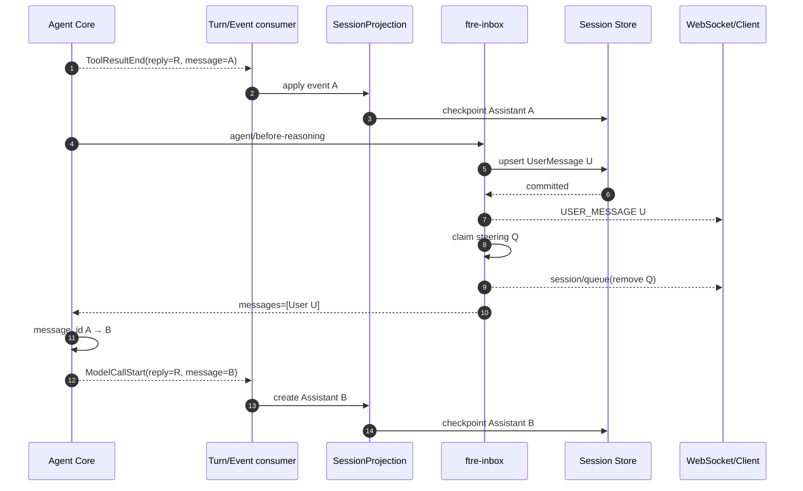

# PRD-F23 Steering 安全边界与多 AssistantMessage 持久化

## 元信息

| 字段 | 值 |
|---|---|
| 阶段 | F23 |
| 名称 | Steering 在 Reasoning 安全边界的 A→User→B 持久化 |
| 状态 | 已验收 |
| 创建日期 | 2026-08-24 |
| 定稿日期 | 2026-08-24 |
| 验收日期 | 2026-08-24 |
| 关联文档 | `docs/TODO.yaml` F23；`PRD-F22-runtime-steering-message-injection.md`；`E:\ftre-agent-core\docs\prd\PRD-C4-user-message-assistant-boundary.md`；`E:\binn\ftre-desktop\docs\prd\PRD-B4-steering-message-projection.md`；`AGENTS.md` |

## 1. 背景与目标

F22 已实现 queue→steer、`agent/before-reasoning` 消费、DB-first UserMessage 和客户端
交接，但因为当前 Core 的全部事件共用一个 `reply_id`，Host 只能在收到 UserMessage 时
复制、重命名并旋转同一个 Assistant 快照。该方案把 Core 消息边界泄漏给
SessionProjection，也增加了 `supports_steering_boundary`、`insert_messages_after()` 和
客户端 segment 推断。

Core C4 将提供稳定 `reply_id` + 每条 AssistantMsg 唯一 `message_id`。本阶段让 ftre
只持久化 Core 明确给出的消息结构：等待当前 LLM/Tool 完成并 checkpoint Assistant A，
随后在 before-reasoning Hook 中持久化正式 UserMessage，再让 Core 的下一次 Reasoning
产生 Assistant B。

目标数据：

```text
AssistantMsg(id=A, reply_id=R)
UserMsg(id=U, request_id=Q)
AssistantMsg(id=B, reply_id=R)
```

### 非目标

- Steering 不取消或抢占当前 LLM/Tool；
- 不在 SessionProjection 中猜测、复制或移动 Tool/Text Block；
- 不给 AgentService 增加 Queue API；
- 不把 Inbox QueueItem 传入 Core；
- 不为 Plugin 临时 inject 伪造正式 UserMessage；
- 不保留 F22 segment 方案作为兼容双路径。

## 2. 冻结数据流程

### 2.1 接纳阶段

```text
用户发送普通消息
→ Inbox next-turn（placement=queued）
→ 用户点击 Steer
→ Inbox promote 到 next-step（placement=steering）
```

此时消息仍属于 pending，不提前进入 Core。客户端继续显示“等待下一次推理”。

### 2.2 当前 Step 完成

Core Event 是串行 async stream；ftre 每处理完一个事件才请求下一个事件。因此：

```text
LLM/Tool A 完成
→ MODEL_CALL_END / TOOL_RESULT_END
→ SessionProjection checkpoint Assistant A
→ Core 才进入 agent/before-reasoning
```

`MODEL_CALL_END`、`TOOL_RESULT_END` 是强制 checkpoint 屏障。UserMessage 不能越过该
屏障提前落到未完成 ToolCall/ToolResult 中间。

### 2.3 UserMessage 持久化与消费

```text
agent/before-reasoning
→ Inbox peek next-step
→ before-claim Hook
→ SessionEventService 幂等持久化 UserMsg U
→ 广播 USER_MESSAGE(U)
→ Inbox claim
→ queue snapshot 移除 Q
→ BeforeReasoningResult(messages=[U])
→ Core 检测 role=user，生成 message_id=B
→ 下一次 Reasoning(B)
```

UserMessage 的稳定 id 由 `session_id + request_id` 生成，并随 Hook mapping 传入 Core；
Core Context、Session Store 和客户端使用同一个 U。

### 2.4 最终时序



## 3. 功能需求

- [x] **FR1：消费前 Assistant checkpoint 屏障**
  - LLM/Tool 的结束事件必须先由 SessionProjection 完成 checkpoint；
  - before-reasoning 不得与前一个 Event 的持久化并发；
  - 写 UserMessage 前，Assistant A 的 ToolCall/ToolResult 必须完整。

- [x] **FR2：正式 UserMessage 使用稳定 id**
  - `SessionEventService` 返回或暴露稳定 UserMessage id；
  - Inbox claim 后返回给 Core 的 mapping 保存 id、role、content、attachments 和 metadata；
  - 同 request_id 重试不重复落库、不重复进入 Core Context。

- [x] **FR3：Inbox 仍唯一拥有 pending/claim**
  - `followup`、`steer`、`inject` 和 next-turn/next-step 继续归 Inbox Package；
  - 正式 source=user 的 next-step 产生 UserMessage；
  - 非正式 Plugin inject 不伪装为 role=user，使用 system/hint 语义；
  - UserMessage 持久化失败时禁止 claim，pending 保留。

- [x] **FR4：SessionProjection 按 message_id 路由**
  - `reply_id` 只关联整次 Reply；`message_id` 是 Assistant Msg.id；
  - A 的后续 Tool/Token 事件只能更新 A；B 的事件创建或更新 B；
  - Reply snapshot 同时携带 reply_id、message_id 和 revision；
  - Gateway 重启可从持久化 A/U/B 恢复当前 B。

- [x] **FR5：删除 F22 人工 segment 方案**
  - 删除 `_project_steering_user_message()`；
  - 删除 `supports_steering_boundary`；
  - 删除只为 Steering 提供的 `insert_messages_after()` Service/Repository API；
  - 删除 `reply_id:segment:<user_id>` 派生 id 和对应 fallback；
  - 删除相关测试、注释和执行报告中的现行架构描述，保留历史变更记录。

- [x] **FR6：普通 queue、idle fallback 与失败语义不回归**
  - 普通 queue 仍由 next-turn worker 执行；
  - active Turn 已自然结束时，steer fallback 为下一独立 Turn；
  - 已幂等持久化的 UserMessage 不被 AgentLoop 再写一遍；
  - 多 Session 隔离，取消、断线、重试和进程恢复不丢消息。

- [x] **FR7：Core 版本与 Composition 边界**
  - ftre 声明包含 C4 message_id 契约的 Core 版本；
  - 不 vendor Core，不增加本地转换层或兼容 alias；
  - Inbox/Session/Agent Plugin inject/provide 和卸载语义保持可逆。

## 4. 代码位置与改动

| 文件 | 当前问题 | F23 改动 |
|---|---|---|
| `packages/ftre-inbox/src/ftre_inbox/plugin.py` | Hook 只返回 role/content | 返回稳定 UserMessage id/metadata；正式 user 与临时 inject 分流 |
| `packages/ftre-inbox/src/ftre_inbox/service.py` | before-reasoning 内持久化后 claim，但返回值丢失 message id | 保持 checkpoint→User→claim 顺序；把同一 U 交给 Core；失败保留 pending |
| `packages/ftre-inbox/src/ftre_inbox/models.py` | QueueItem 无历史消息关联 | 仅在确有恢复需要时保存 `history_message_id`，不得增加重复消息实体 |
| `src/ftre/services/session/events.py` | Steering Event 通过 mode 触发 Host 切分 | 只负责稳定 UserMessage 幂等落库/广播，不携带 Projection 私有 steer 分支 |
| `src/ftre/services/session/projection.py` | 按 reply_id 聚合并人工旋转 segment | 按 message_id 投影；新 message_id 自然创建新 AssistantMsg |
| `src/ftre/services/session/service.py` | 暴露 `supports_steering_boundary` 和宽泛插入 API | 删除 Steering capability flag 与公共重排 API |
| `src/ftre/services/session/persistence/repository.py` | 为 segment 提供任意 anchor 插入 | 删除仅供 F22 的重排方法，恢复普通唯一 id upsert/update |
| `src/ftre/services/agent/runtime/turn_executor.py` | 文档假定 turn/reply/message 同一坐标 | 透传 Core reply_id/message_id，不自行生成消息边界 |
| `src/ftre/services/agent/runtime/engine.py` | 普通 Turn 可能重复持久化已提交 steer | 识别稳定 request/message id，避免 idle fallback 重复 UserMsg |
| `tests/test_session_projection.py` | 验证 Host 人工 segment | 改为验证 Core A/U/B 的 message_id 投影 |
| `packages/ftre-inbox/tests/test_plugin_hook.py` | 只断言 LLM 能看到 steer | 增加 A checkpoint→U→B、稳定 id 和 Tool 配对断言 |
| `tests/startup/test_f12_ws_smoke.py` | 验证协议 mode | 扩展真实 Gateway 的 A/U/B WebSocket 顺序与重连 |

## 5. 状态与失败矩阵

| 场景 | Session 历史 | Inbox | Core |
|---|---|---|---|
| Tool 尚未结束 | A 持续 checkpoint | U 仍 steering | 继续 A |
| A checkpoint 成功 | A 完整 | U 等待消费 | 准备 Hook |
| U 落库失败 | 只有 A | U 保留 pending | 不注入、不创建 B |
| U 落库成功、claim 前崩溃 | A→U | U 仍 pending | 重启后幂等重试 |
| claim 成功 | A→U | U 移除 | Context 加 U，message_id=B |
| B 首事件到达 | A→U→B | 无 U | 继续 B |
| active Turn 自然结束 | A 完成 | U fallback next-turn | 新 Turn 执行 U |

## 6. 验收标准

- [x] **AC1**：真实 Tool 阻塞期间 steer 不提前进入 Core；ToolResultEnd checkpoint 后才写 U。
- [x] **AC2**：Session、Core Context 和 WebSocket 最终顺序均为 A→U→B，三者 id 一致。
- [x] **AC3**：A 和 B 具有不同 message_id、相同 reply_id；ToolCall/ToolResult 只属于 A。
- [x] **AC4**：SessionProjection、Service 和 Repository 中 F22 segment 实现全部删除且无引用。
- [x] **AC5**：USER_MESSAGE 落库失败、重复 request、claim 前崩溃、idle fallback、取消和重连测试通过。
- [x] **AC6**：Inbox Plugin unload/restart 不残留 Hook、Worker、Receipt 或 Session 引用。
- [x] **AC7**：后端全量 pytest、architecture/contracts/startup/lifecycle、ruff、diff check、Gateway smoke 通过。
- [x] **AC8**：Core C4 wheel/洁净安装和 Desktop B4 全量验证通过。

## 7. 变更记录

| 日期 | 变更内容 | 理由 |
|---|---|---|
| 2026-08-24 | 创建 F23 草稿；用 Core message_id 取代 Host/客户端按 reply_id 人工切分 | 用户要求 Steering 保持下一次 Reasoning 注入，同时 Core、ftre、客户端的数据都天然表现为 A→User→B |
| 2026-08-24 | 完成 Inbox DB-first 交付、SessionProjection message_id 路由、F22 segment 清理及全量后端验证 | 让 Host 只负责持久化/队列边界，不再复制 Core 的消息切分 |
| 2026-08-24 | 审计收口：Inbox Plugin 对已声明的 `session_events` 改用注入属性读取，并补充 Core→Projection 跨层回归 | 消除必选依赖的动态 Locator，证明真实 Core 事件可由 ftre 持久化为 A→User→B |
