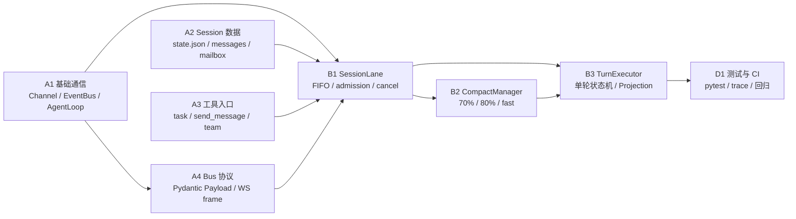
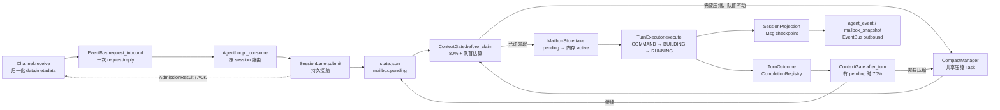

# ftre PRD 总览与跨阶段架构契约

> 本目录中的 PRD 是根据当前代码、测试和运行行为反推形成的。阶段 PRD 负责
> “做什么”和“如何验收”，本文负责跨阶段的术语、依赖和不可违反的边界。
>
> 如果本文与某个阶段 PRD 冲突，以最近一次经过「变更记录」修订的阶段 PRD 为准，
> 同时必须补回本文，避免同一事实在多个文档中漂移。

## 1. 阶段地图

| 层 | 事实源 | 不应该负责的事情 |
|---|---|---|
| Channel | `PRD-A1`、`PRD-A4` | 不执行 Agent、不管理 FIFO、不猜测 Turn 状态 |
| EventBus | `PRD-A1`、`PRD-A4` | 不持久化业务消息、不作为崩溃恢复队列 |
| AgentLoop | `PRD-A1`、`PRD-B1` | 不直接实现单轮 Agent 逻辑、不复制 Session 状态 |
| SessionLane | `PRD-B1` | 不实现 LLM 压缩算法、不聚合 Reply 内容 |
| MailboxStore / state.json | `PRD-A2`、`PRD-B1` | 不保存 active Turn 或 CompletionRegistry 结果 |
| ContextGate / CompactManager | `PRD-B1`、`PRD-B2` | 不领取队列、不直接向 WebSocket 发消息 |
| TurnExecutor / Projection | `PRD-B3` | 不决定下一条何时领取、不启动自动压缩 |
| 测试与 CI | `PRD-D1` | 不新增业务行为；只验证各阶段契约 |

## 2. 唯一端到端流程

### 2.1 三种“成功”必须分开

1. **接纳成功**：`AdmissionResult.accepted=True`，表示 request 已原子写入
   `mailbox.pending`。这是 WS、HTTP、invoke、task、team_say 可以立即返回的成功。
2. **执行开始**：队首通过 ContextGate 后被 `MailboxStore.take` 领取，形成内存
   `TurnOperation`。此时它不再属于 pending，也不应再次执行。
3. **执行完成**：TurnExecutor 返回 `TurnOutcome`，Reply/消息投影已收尾，
   CompletionRegistry 唤醒同进程等待者。它不是 Bus ACK，也不是 pending 快照。

## 3. 数据和状态的唯一来源

### 3.1 持久数据

- `state.json.session`：Session 身份、channel、workspace、title。
- `state.json.messages`：已投影的 User/Assistant/compact Msg；按数组顺序保存历史。
- `state.json.mailbox.pending`：尚未领取的 QueueItem；只有它决定刷新后还能执行什么。
- `state.json.mailbox.revision`：Mailbox 快照版本；运行态变化也会推进它，但不写 active 对象。

### 3.2 进程内数据

- `SessionLane._operation`：当前 Turn、压缩或 blocked 状态。
- `SessionLane._worker`：每个 session 唯一消费任务。
- `CompletionRegistry`：当前进程按 request_id 等待 TurnOutcome。
- `SessionProjection`：正在生成的 Reply 和活跃 compact 事件；语义边界 checkpoint 后才能恢复。

### 3.3 不持久化的异常语义

`MailboxStore.take` 成功后到 UserMsg 写入前进程退出，active 请求不自动重放；
这是为了避免 bash、write、MCP 等工具产生重复副作用。已 checkpoint 的 Reply Msg
仍保留，用户可以根据历史继续发起下一条请求。

## 4. 三个 ID 不可混用

| ID | 生产位置 | 生命周期 | 用途 |
|---|---|---|---|
| `BusMessage.id` | EventBus 创建/接收 Bus 信封时 | 进程内一次 request/reply | `EventBus._inbound_replies` 的传输关联键 |
| `request_id` | WS `frame_id` 或服务端入口生成 | 业务请求生命周期 | Mailbox 幂等、UserMsg 关联、取消、CompletionRegistry 等待 |
| `turn_id` | SessionLane 成功 take 后生成 | 一次实际执行 | Reply/Turn 事件关联；一个 request 最多对应一个实际 Turn |

`BusMessage.id` 不能替代 `request_id`。Bus 重试可以产生新的 Bus 信封，但必须复用同一个业务 `request_id`，否则会绕过 Mailbox 幂等。

## 5. request_id 贯穿规则

`request_id` 是一次用户输入在以下位置的同一标识：

`WS frame_id → InboundMetadata.request_id → QueueItem.request_id → UserMsg.metadata.request_id → cancel / wait`

- WS 用户消息必须有非空 frame_id；重试必须复用原 frame_id。
- 服务端内部入口没有 request_id 时，只能在最外层生成一次，后续不得层层生成新 ID。
- 相同 request_id 在 pending 或已写入 UserMsg 时只返回已有接纳/去重结果，不重复执行。
- `turn_id` 只标识一次实际执行，不替代 request_id；一个 request 最多产生一个 Turn。

## 6. 状态快照和客户端契约

`session_event:mailbox_snapshot` 是队列和运行态的权威投影，Payload 包含：

`session_id、revision、phase、pending、capacity、accepting_messages、can_cancel_active、blocked_reason`

- `phase` 只表示当前 Lane operation：`idle / running / cancelling / compacting / blocked`。
- `pending` 是独立列表；`phase=idle` 不等于 pending 为空，客户端必须同时读取两者。
- attach 时先登记连接，再在同一输出锁内发送 `reply_snapshot`；之后的实时事件不能插到快照之前。
- `agent_event` 的顺序保证是 Projection 落盘成功后再广播；实时流不是历史事实源。
- `turn_cancel` 是控制面消息，不进入 mailbox，不写成 `/cancel` UserMsg。

## 7. 失败、取消与恢复矩阵

| 场景 | 结果 | pending | messages | 客户端应看到 |
|---|---|---|---|---|
| 队列已满 | `accepted=False / queue_full` | 不变 | 不变 | failed ACK |
| Session 关闭/删除 | `accepted=False / session_closing` | 保留至删除或显式处置 | 已有历史保留至删除 | failed ACK |
| 取消 active | 当前 Turn `cancelled` | 不变，继续 FIFO | 已写 User/Reply 标记 interrupted | cancelling → 下一状态 |
| 取消 queued | 指定 request `cancelled` | 删除该项 | 不写历史 UserMsg | 快照移除该项 |
| 压缩失败但仍安全 | 由 ContextGate 尝试 fast 或继续 | 队首保持 pending | 不写错误摘要 | compacting/blocked 事件 |
| 压缩后仍超硬线 | `blocked` | 队首保留 | 历史不被盲跑 | blocked_reason |
| Gateway 重启 | 恢复 pending，active 不重放 | pending 恢复 | messages/已 checkpoint Reply 恢复 | attach snapshot |

## 8. 反推 PRD 的验收方法

每次修改代码或协议，至少回答以下问题，并把结果写回对应阶段 PRD 的变更记录：

1. 输入从哪个 Channel 进入？是否经过 EventBus request/reply？
2. durable admission 的落盘点在哪里？ACK 是否早于落盘？
3. request_id、turn_id、Msg.id 各自代表什么？是否被错误复用？
4. 消息当前属于 pending、active、messages 还是 CompletionRegistry？重启后去哪儿？
5. 取消、压缩失败、队列满、Session 删除和 Gateway 停止时，谁负责收尾？
6. 客户端只订阅哪些下行事件？是否需要依赖刷新或猜测状态？
7. 是否有自动化测试覆盖正常路径、边界路径和恢复路径？未覆盖项必须标为待补。

阶段 PRD 的「验收标准」只允许勾选已经有测试或可复现实验依据的条目；
仅仅“代码看起来实现了”不能作为验收证据。

## 9. 当前待补验证项

以下不是架构设计缺口，而是当前代码尚未由独立自动化用例证明的地方，不能在阶段 PRD 中继续无条件标记为“已验证”：

- `send_message` 的 notify/invoke 路由、队列满和自发消息拒绝。
- team 工具的多条成员消息、request_id 等待和 team_delete 竞态。
- `wait_session_quiescent` 与 Turn 收尾之间的瞬时竞态，需要用测试证明不会提前返回。
- Gateway stop 与 WS ingress、真实 compact Task 的完整顺序，需要集成测试覆盖。
- 全量 `pytest -q`、ruff 和干净环境 CI 结果，需要在 D1 留存命令输出。

## 10. 文档变更规则

- 同阶段范围内的职责澄清、字段修正、验收细化：修改原 PRD 正文，并在末尾追加日期、内容、理由和受影响 AC 复核结果。
- 新增跨阶段协议或改变持久化语义：先修改本文，再同步 A4/B1/A2 等事实源；如果超出现有阶段范围，新增 TODO 阶段 PRD。
- 不把临时兼容字段写成长期契约；协议字段必须说明生产方、消费方、持久化与生命周期。
